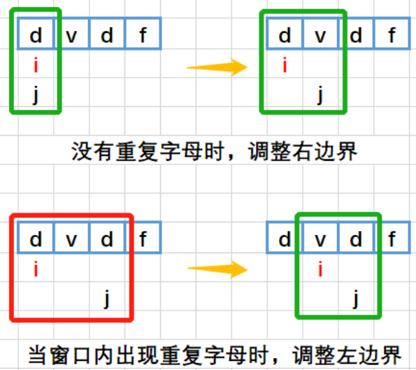

给定一个字符串 `s` ，请你找出其中不含有重复字符的 **最长 子串** 的长度。
**示例 1:**
**输入:** s = "abcabcbb"
**输出:** 3 
**解释:** 因为无重复字符的最长子串是 `"abc"`，所以其长度为 3。
**示例 2:**
**输入:** s = "bbbbb"
**输出:** 1
**解释:** 因为无重复字符的最长子串是 `"b"`，所以其长度为 1。
**示例 3:**
**输入:** s = "pwwkew"
**输出:** 3
**解释:** 因为无重复字符的最长子串是 `"wke"`，所以其长度为 3。
     请注意，你的答案必须是 **子串** 的长度，`"pwke"` 是一个_子序列，_不是子串。

**提示：**
- `0 <= s.length <= 5 * 104`
- `s` 由英文字母、数字、符号和空格组成

```C++
#include <unordered_map>
#include <string>
#include <algorithm>

class Solution {
public:
    int lengthOfLongestSubstring(std::string s) {
        std::unordered_map<char, int> char_map; // 存储字符及其最后出现的位置
        int max_len = 0;
        int left = 0; // 窗口左边界
        
        for (int right = 0; right < s.size(); ++right) {
            // 如果字符已存在且在当前窗口内，更新左边界
            if (char_map.find(s[right]) != char_map.end() && char_map[s[right]] >= left) {
                left = char_map[s[right]] + 1;
            }
            // 更新字符的最后出现位置
            char_map[s[right]] = right;
            // 计算当前窗口长度并更新最大值
            max_len = std::max(max_len, right - left + 1);
        }
        
        return max_len;
    }
};
```

```C#
using System;
using System.Collections.Generic;

public class Solution {
    public int LengthOfLongestSubstring(string s) {
        Dictionary<char, int> charMap = new Dictionary<char, int>(); // 存储字符及其最后出现的位置
        int maxLen = 0;
        int left = 0; // 窗口左边界
        
        for (int right = 0; right < s.Length; right++) {
            // 如果字符已存在且在当前窗口内，更新左边界
            if (charMap.ContainsKey(s[right]) && charMap[s[right]] >= left) {
                left = charMap[s[right]] + 1;
            }
            // 更新字符的最后出现位置
            charMap[s[right]] = right;
            // 计算当前窗口长度并更新最大值
            maxLen = Math.Max(maxLen, right - left + 1);
        }
        
        return maxLen;
    }
}
```
