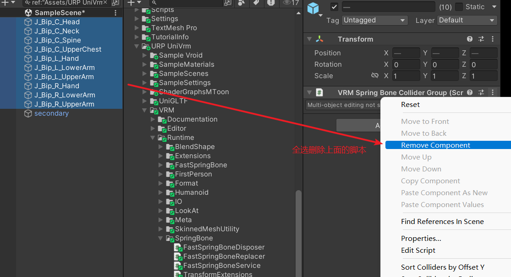
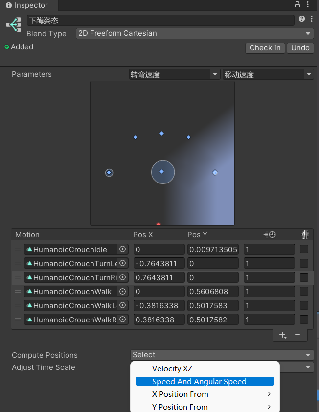
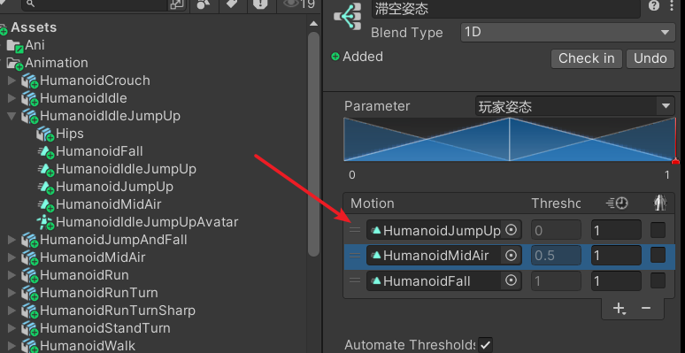
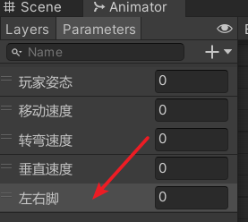
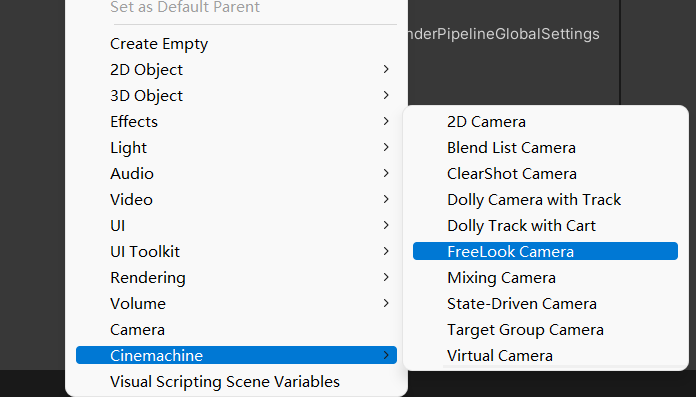
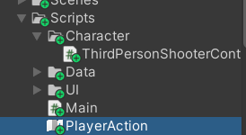
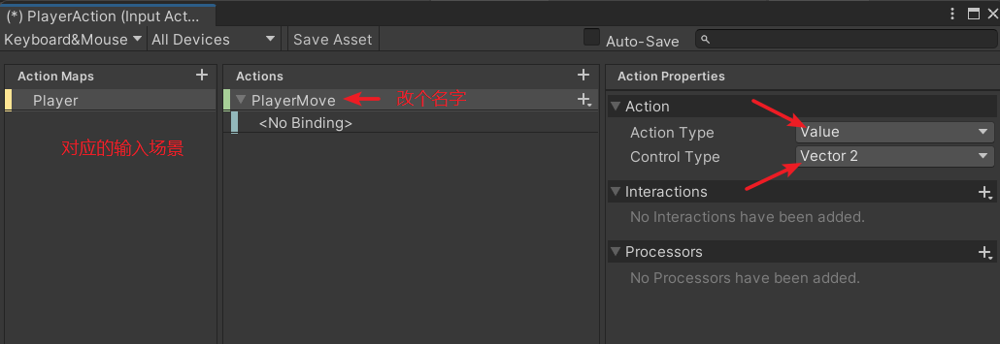

在 Unity 中，TPS 通常是指第三人称射击（Third - Person Shooter）游戏类型。
3C 通常指的是 Character（角色）、Camera（摄像机）、Control（控制）
### 角色准备
在GitHub中找到这个包，导入Unity中就可以将vroid中的角色拖进去了。

首先删除角色身上的所有脚本

新拖入的角色有紫色的球

删除所有的物体上的VRMSPringBoneColliderGroup脚本

secondary是头发相关的控制，我们将它整个删掉。


这里准备的动作资源是这个有点老。需要手动到Unity中跟换一下api，有备注，按备注改即可。资源商城中已经找不到了。


### Character（角色）
有限状态机

制作Controller

#### 站立姿态混合树
（有多方向不同速度的运动就使用2dFreeFormDirectional）所以这里我们选Cartesian。


#### 下蹲状态混合树


PackageManager中找到InputSystem


新建角色控制脚本    
#### ThirdPersonShooterController.cs
```C#
using System;  
using System.Collections;  
using System.Collections.Generic;  
using UnityEngine;  
using UnityEngine.InputSystem;  
  
public class ThirdPersonShooterController : MonoBehaviour  
{  
    Transform playerTransform;  
    Animator animator;  
    Transform cameraTransform;  
    CharacterController characterController;      
      
public enum PlayerPosture  
    {  
        Crouch,  
        Stand,  
        Midair  
    };  
    public PlayerPosture playerPosture = PlayerPosture.Stand;  
  
    float crouchThreshold = 0f;  
    float standThreshold = 1f;  
    float midairThreshold = 2f;  
  
    public enum LocomotionState  
    {  
        Idle,  
        Walk,  
        Run  
    };  
    public LocomotionState locomotionState = LocomotionState.Idle;  
  
    public enum ArmState  
    {  
        Normal,  
        Aim  
    };  
    public ArmState armState = ArmState.Normal;  
  
    float crouchSpeed = 1.5f;  
    float walkSpeed = 2.5f;  
    float runSpeed = 5.5f;  
  
    Vector2 moveInput;  
    bool isRunning;  
    bool isCrouch;  
    bool isAiming;  
    bool isJumping;  
    int postureHash;  
    int moveSpeedHash;  
    int turnSpeedHash;  
  
    // 玩家实际要移动的方向  
    Vector3 playerMovement = Vector3.zero;  
    // Start is called before the first frame update  
    void Start()  
    {        playerTransform = transform;  
        animator = GetComponent<Animator>();  
        cameraTransform = Camera.main.transform;  
        characterController = GetComponent<CharacterController>();  
        postureHash = Animator.StringToHash("玩家姿态");  
        moveSpeedHash = Animator.StringToHash("移动速度");  
        turnSpeedHash = Animator.StringToHash("转弯速度");  
        Cursor.lockState = CursorLockMode.Locked;  
    }  
// Update is called once per frame  
    void Update()  
    {        SwitchPlayerStates();  
        CaculateInputDirection();  
        SetupAnimator();  
    }    #region 输入相关  
    public void GetMoveInput(InputAction.CallbackContext ctx)  
    {        moveInput = ctx.ReadValue<Vector2>();  
    }  
    public void GetRunInput(InputAction.CallbackContext ctx)  
    {        isRunning = ctx.ReadValueAsButton();  
    }  
    public void GetCrouchInput(InputAction.CallbackContext ctx)  
    {        isCrouch = ctx.ReadValueAsButton();  
    }  
    public void GetAimInput(InputAction.CallbackContext ctx)  
    {        isAiming = ctx.ReadValueAsButton();  
    }    #endregion  
    void SwitchPlayerStates()  
    {        if (isCrouch)  
        {            playerPosture = PlayerPosture.Crouch;  
        }        else  
        {  
            playerPosture = PlayerPosture.Stand;  
        }  
        if (moveInput.magnitude == 0)  
        {            locomotionState = LocomotionState.Idle;  
        }        else if (!isRunning)  
        {            locomotionState = LocomotionState.Walk;  
        }        else  
        {  
            locomotionState = LocomotionState.Run;  
        }  
        if (isAiming)  
        {            armState = ArmState.Aim;  
        }        else  
        {  
            armState = ArmState.Normal;  
        }    }    // 将世界坐标系下的方向，转换成相机坐标系下的方向  
    void CaculateInputDirection()  
    {        Vector3 camForwardProjection = new Vector3(cameraTransform.forward.x, 0, cameraTransform.forward.z).normalized;  
        playerMovement = camForwardProjection * moveInput.y + cameraTransform.right * moveInput.x;  
        playerMovement = playerTransform.InverseTransformVector(playerMovement);  
    }  
    void SetupAnimator()  
    {        if (playerPosture == PlayerPosture.Stand)  
        {            animator.SetFloat(postureHash, standThreshold, 0.1f, Time.deltaTime);  
            switch (locomotionState)  
            {                case LocomotionState.Idle:  
                    animator.SetFloat(moveSpeedHash, 0, 0.1f, Time.deltaTime);  
                    break;  
                case LocomotionState.Walk:  
                    animator.SetFloat(moveSpeedHash, playerMovement.magnitude * walkSpeed, 0.1f, Time.deltaTime);  
                    break;  
                case LocomotionState.Run:  
                    animator.SetFloat(moveSpeedHash, playerMovement.magnitude * runSpeed, 0.1f, Time.deltaTime);  
                    break;  
            }        }        else if (playerPosture == PlayerPosture.Crouch)  
        {            animator.SetFloat(postureHash, crouchThreshold, 0.1f, Time.deltaTime);  
            switch (locomotionState)  
            {                case LocomotionState.Idle:  
                    animator.SetFloat(moveSpeedHash, 0, 0.1f, Time.deltaTime);  
                    break;  
                default:  
                    animator.SetFloat(moveSpeedHash, playerMovement.magnitude * crouchSpeed, 0.1f, Time.deltaTime);  
                    break;  
            }        }  
        if (armState == ArmState.Normal)  
        {            // 当前移动方向和玩家transform正前方Forward之间的夹角，用弧度表示，和root motion的转向速度单位一致  
            float rad = Mathf.Atan2(playerMovement.x, playerMovement.z);  
            animator.SetFloat(turnSpeedHash,rad,0.1f, Time.deltaTime);  
            // 转速太慢，人为添加一个旋转  
            playerTransform.Rotate(0, rad *200 *Time.deltaTime, 0f);  
        }    }  
    //  Animator 组件进行动画更新时，这个方法会被调用。  
    //  OnAnimatorMove方法为开发者提供了一个在动画更新过程中进行自定义操作的机会，使动画与游戏逻辑更加紧密地结合在一起  
    private void OnAnimatorMove()  
    {        characterController.Move(animator.deltaPosition);  
    }}
```
这里是人物站立，行走，下蹲的做好时候的方法。
下面我们还需要去做人物的跳跃

#### 人物的跳跃


(待完善)

给玩家添加跳跃的随机脚




跳跃完善后的代码
```
using System;  
using System.Collections;  
using System.Collections.Generic;  
using UnityEngine;  
using UnityEngine.InputSystem;  
using Random = UnityEngine.Random;  
  
public class ThirdPersonShooterController : MonoBehaviour  
{  
    Transform playerTransform;  
    Animator animator;  
    Transform cameraTransform;  
    CharacterController characterController;      
      
public enum PlayerPosture  
    {  
        Crouch,  
        Stand,  
        Jumping,  
        Falling,  
        // 玩家刚落地还不能起跳的状态  
        Landing  
    };  
    public PlayerPosture playerPosture = PlayerPosture.Stand;  
  
    float crouchThreshold = 0f;  
    float standThreshold = 1f;  
    float midairThreshold = 2.1f;  
    float landingThreshold = 1f;  
    public enum LocomotionState  
    {  
        Idle,  
        Walk,  
        Run  
    };  
    public LocomotionState locomotionState = LocomotionState.Idle;  
  
    public enum ArmState  
    {  
        Normal,  
        Aim  
    };  
    public ArmState armState = ArmState.Normal;  
  
    float crouchSpeed = 1.5f;  
    float walkSpeed = 2.5f;  
    float runSpeed = 5.5f;  
  
    Vector2 moveInput;  
    bool isRunning;  
    bool isCrouch;  
    bool isAiming;  
    bool isJumping;  
    int postureHash;  
    int moveSpeedHash;  
    int turnSpeedHash;  
    int verticalVelHash;  
    private int feetTweenHash;  
    // 玩家实际要移动的方向  
    Vector3 playerMovement = Vector3.zero;  
    // 重力  
    public float gravity = -9.8f;  
    // 垂直方向速度  
    private float VerticalVelocity;  
  
    //public float jumpVelocity = 5f;  
  
    // 最大起跳高度  
    public float maxHeight = 1.5f;  
    private Vector3 lastVelOnGround;  
  
    private static readonly int CACHE_SIZE = 3;  
    Vector3[] velCache = new Vector3[CACHE_SIZE];  
    // 缓存池中最老的那个向量的索引值  
    int currentChacheIndex = 0;    
Vector3 averageVel = Vector3.zero;  
    // 左右脚滞空状态  
    private float feetTween;  
  
    //下落时候的速度是上升时候的多少倍  
    private float fallMultiplier = 1.5f;  
  
    private bool isGrounded;  
    // 为射线检测设置一个偏移量  
    private float groundCheckOffset = 0.5f;  
    // 跳跃的cd设置  
    private float jumpCD =0.15f;  
    // 玩家是否处于CD当中  
    bool isLanding;  
    // 玩家是否可以跌落  
    private bool couldFall;  
    // 跌落的最小高度，小于此高度不会跌落  
    private float fallHeight = 0.5f;  
    // Start is called before the first frame update  
    void Start()  
    {        playerTransform = transform;  
        animator = GetComponent<Animator>();  
        cameraTransform = Camera.main.transform;  
        characterController = GetComponent<CharacterController>();  
        postureHash = Animator.StringToHash("玩家姿态");  
        moveSpeedHash = Animator.StringToHash("移动速度");  
        turnSpeedHash = Animator.StringToHash("转弯速度");  
        verticalVelHash = Animator.StringToHash("垂直速度");  
        feetTweenHash = Animator.StringToHash("左右脚");  
        Cursor.lockState = CursorLockMode.Locked;  
    }  
// Update is called once per frame  
    void Update()  
    {        CheckGround();  
        CaculateInputDirection();  
        CaculateGravity();  
        Jump();  
        SwitchPlayerStates();  
        SetupAnimator();  
    }    #region 输入相关  
    public void GetMoveInput(InputAction.CallbackContext ctx)  
    {        moveInput = ctx.ReadValue<Vector2>();  
    }  
    public void GetRunInput(InputAction.CallbackContext ctx)  
    {        isRunning = ctx.ReadValueAsButton();  
    }  
    public void GetCrouchInput(InputAction.CallbackContext ctx)  
    {        isCrouch = ctx.ReadValueAsButton();  
    }  
    public void GetAimInput(InputAction.CallbackContext ctx)  
    {        isAiming = ctx.ReadValueAsButton();  
    }  
    public void GetJumpInput(InputAction.CallbackContext ctx)  
    {        isJumping = ctx.ReadValueAsButton();  
    }    #endregion  
    void SwitchPlayerStates()  
    {        if (!isGrounded)  
        {            if (VerticalVelocity > 0)  
            {                playerPosture = PlayerPosture.Jumping;  
            }            else if (playerPosture != PlayerPosture.Jumping)  
            {                if (couldFall)  
                {                    playerPosture = PlayerPosture.Falling;  
                }            }              
        }        else if (playerPosture == PlayerPosture.Jumping)  
        {  
            StartCoroutine(CoolDownJump());  
        }        else if (isLanding)  
        {            playerPosture = PlayerPosture.Landing;  
        }        else if (isCrouch)  
        {            playerPosture = PlayerPosture.Crouch;  
        }        else  
        {  
            playerPosture = PlayerPosture.Stand;  
        }  
        if (moveInput.magnitude == 0)  
        {            locomotionState = LocomotionState.Idle;  
        }        else if (!isRunning)  
        {            locomotionState = LocomotionState.Walk;  
        }        else  
        {  
            locomotionState = LocomotionState.Run;  
        }  
        if (isAiming)  
        {            armState = ArmState.Aim;  
        }        else  
        {  
            armState = ArmState.Normal;  
        }    }    // 自己写一个射线检测地面的方法，避免边缘奇怪的bug  
    void CheckGround()  
    {        if (Physics.SphereCast(playerTransform.position + (Vector3.up * groundCheckOffset), characterController.radius, Vector3.down, out RaycastHit hit, groundCheckOffset - characterController.radius + 2 * characterController.skinWidth))  
        {            isGrounded = true;  
        }        else  
        {  
            isGrounded = false;  
            couldFall = !Physics.Raycast(playerTransform.position, Vector3.down, fallHeight);  
        }    }    //   
IEnumerator CoolDownJump()  
    {        landingThreshold = Mathf.Clamp(VerticalVelocity,-10,0);  
        landingThreshold /= 20f;  
        landingThreshold += 1f;  
        isLanding = true;  
        playerPosture = PlayerPosture.Landing;  
        yield return new WaitForSeconds(jumpCD);  
       isLanding = false;  
    }    // 重力对垂直方向速度影响的方法  
    void CaculateGravity()  
    {        if (playerPosture != PlayerPosture.Jumping && playerPosture != PlayerPosture.Falling)  
        {            if (!isGrounded)  
            {                VerticalVelocity += gravity * fallMultiplier * Time.deltaTime;  
            }            else  
            {  
                VerticalVelocity = gravity * Time.deltaTime;  
            }        }        else  
        {  
            if (VerticalVelocity <= 0 || !isJumping)  
            {                VerticalVelocity += gravity * fallMultiplier * Time.deltaTime;  
            }            else  
            {  
                VerticalVelocity += gravity * Time.deltaTime;  
            }  
        }    }    void Jump()  
    {        if (playerPosture == PlayerPosture.Stand && isJumping)  
        {VerticalVelocity = Mathf.Sqrt(-2 * gravity * maxHeight);  
            feetTween = Mathf.Repeat(animator.GetCurrentAnimatorStateInfo(0).normalizedTime, 1);  
            feetTween = Mathf.Repeat(animator.GetCurrentAnimatorStateInfo(0).normalizedTime,1);  
            feetTween = feetTween < 0.5f ? 1 : -1;  
            if (locomotionState == LocomotionState.Run)  
            {                feetTween *= 3;  
            }            else if (locomotionState == LocomotionState.Walk)  
            {                feetTween *= 2;  
            }            else  
            {  
                feetTween = Random.Range(0.5f, 1f) * feetTween;  
            }        }    }    // 将世界坐标系下的方向，转换成相机坐标系下的方向  
    void CaculateInputDirection()  
    {        Vector3 camForwardProjection = new Vector3(cameraTransform.forward.x, 0, cameraTransform.forward.z).normalized;  
        playerMovement = camForwardProjection * moveInput.y + cameraTransform.right * moveInput.x;  
        playerMovement = playerTransform.InverseTransformVector(playerMovement);  
    }  
    void SetupAnimator()  
    {        if (playerPosture == PlayerPosture.Stand)  
        {            animator.SetFloat(postureHash, standThreshold, 0.1f, Time.deltaTime);  
            switch (locomotionState)  
            {                case LocomotionState.Idle:  
                    animator.SetFloat(moveSpeedHash, 0, 0.1f, Time.deltaTime);  
                    break;  
                case LocomotionState.Walk:  
                    animator.SetFloat(moveSpeedHash, playerMovement.magnitude * walkSpeed, 0.1f, Time.deltaTime);  
                    break;  
                case LocomotionState.Run:  
                    animator.SetFloat(moveSpeedHash, playerMovement.magnitude * runSpeed, 0.1f, Time.deltaTime);  
                    break;  
            }        }        else if (playerPosture == PlayerPosture.Crouch)  
        {            animator.SetFloat(postureHash, crouchThreshold, 0.1f, Time.deltaTime);  
            switch (locomotionState)  
            {                case LocomotionState.Idle:  
                    animator.SetFloat(moveSpeedHash, 0, 0.1f, Time.deltaTime);  
                    break;  
                default:  
                    animator.SetFloat(moveSpeedHash, playerMovement.magnitude * crouchSpeed, 0.1f, Time.deltaTime);  
                    break;  
            }        }        else if (playerPosture == PlayerPosture.Jumping)  
        {            animator.SetFloat(postureHash, midairThreshold);  
            animator.SetFloat(verticalVelHash, VerticalVelocity);  
            animator.SetFloat(feetTweenHash, feetTween);  
        }        // 避免处于cd时候不能移动  
        else if (playerPosture == PlayerPosture.Landing)  
        {            animator.SetFloat(postureHash, landingThreshold, 0.03f, Time.deltaTime);  
            switch (locomotionState)  
            {                case LocomotionState.Idle:  
                    animator.SetFloat(moveSpeedHash, 0, 0.1f, Time.deltaTime);  
                    break;  
                case LocomotionState.Walk:  
                    animator.SetFloat(moveSpeedHash, playerMovement.magnitude * walkSpeed, 0.1f, Time.deltaTime);  
                    break;  
                case LocomotionState.Run:  
                    animator.SetFloat(moveSpeedHash, playerMovement.magnitude * runSpeed, 0.1f, Time.deltaTime);  
                    break;  
            }        }        else if (playerPosture == PlayerPosture.Falling)  
        {            animator.SetFloat(postureHash, midairThreshold);  
            animator.SetFloat(verticalVelHash, VerticalVelocity);  
        }  
        if (armState == ArmState.Normal)  
        {            // 当前移动方向和玩家transform正前方Forward之间的夹角，用弧度表示，和root motion的转向速度单位一致  
            float rad = Mathf.Atan2(playerMovement.x, playerMovement.z);  
            animator.SetFloat(turnSpeedHash, rad, 0.1f, Time.deltaTime);  
            // 转速太慢，人为添加一个旋转  
            playerTransform.Rotate(0, rad * 200 * Time.deltaTime, 0f);  
        }    }  
    // 计算平均速度  
    Vector3 AverageVel(Vector3 newVel)  
    {        velCache[currentChacheIndex] = newVel;  
        currentChacheIndex++;  
        currentChacheIndex %= CACHE_SIZE;  
        Vector3 average = Vector3.zero;  
        foreach(Vector3 vel in velCache)  
        {            average += vel;  
        }        return average / CACHE_SIZE;  
    }    //  Animator 组件进行动画更新时，这个方法会被调用。  
    //  OnAnimatorMove方法为开发者提供了一个在动画更新过程中进行自定义操作的机会，使动画与游戏逻辑更加紧密地结合在一起  
    private void OnAnimatorMove()  
    {        if(playerPosture != PlayerPosture.Jumping && playerPosture != PlayerPosture.Falling)  
        {            Vector3 playerDeltaMovement = animator.deltaPosition;  
            playerDeltaMovement.y = VerticalVelocity * Time.deltaTime;  
            characterController.Move(playerDeltaMovement);  
            averageVel = AverageVel(animator.velocity);  
        }        else  
        {  
            // 沿用地面速度当作滞空速度，采用离地前几帧的平均速度  
            averageVel.y = VerticalVelocity;  
            Vector3 playerDeltaMovement = averageVel * Time.deltaTime;  
            characterController.Move(playerDeltaMovement);  
        }    }}
```

```
using System.Collections;  
using System.Collections.Generic;  
using UnityEngine;  
using UnityEngine.InputSystem;  
using UnityEngine.InputSystem.XR;  
  
public class ThirdPersonShooterController : MonoBehaviour  
{  
    Transform playerTransform;  
    Animator animator;  
    Transform cameraTransform;  
    CharacterController controller;  
    public enum PlayerPosture  
    {  
        Crouch,  
        Stand,  
        Falling,  
        Jumping,  
        Landing  
    };  
  
    [HideInInspector]  
    public PlayerPosture playerPosture = PlayerPosture.Stand;  
  
    float crouchTreshold = 0f;  
    float standTHreshold = 1f;  
    float midairThreshold = 2.1f;  
    float landingThreshold = 1f;  
  
    public enum LocomotionState  
    {   
Idle,  
        Walk,  
        Run  
    }  
    [HideInInspector]  
    public LocomotionState locomotionState = LocomotionState.Idle;  
    public enum ArmState  
    {  
        Normal,  
        Aim  
    }  
    [HideInInspector]  
    public ArmState armState = ArmState.Normal;  
    float crouchSpeed = 1.5f;  
    float walkSpeed = 2.5f;  
    float runSpeed = 5.5f;  
  
    Vector2 moveInput;  
    bool isRunning;  
    bool isCrouch;    
bool isAiming;  
    bool isJumping;  
    int postureHash;  
    int moveSpeedHash;  
    int turnSpeedHash;  
    int verticalVelHash;  
    int feetTweenHash;  
  
    Vector3 playerMovement = Vector3.zero;  
  
    public float gravity = -9.8f;  
    float VerticalVelocity;  
    public float maxHeight = 1.5f;  
  
    float feetTween;  
  
    Vector3 lastVelOnGround;  
  
    static readonly int CACHE_SIZE = 3;  
    Vector3[] velCache = new Vector3[CACHE_SIZE];  
    int currentChacheIndex = 0;   
    Vector3 averageVel = Vector3.zero;  
  
    float fallMultiplier = 1.5f;  
  
    bool isGrounded;  
  
    bool couldFall;  
  
    float fallHeight = 0.5f;  
    bool isLanding;  
  
    float groundCheckOffset = 0.5f;  
  
    float jumpCD = 0.15f;  
  
    // Start is called before the first frame update  
    void Start()  
    {        playerTransform = transform;      
animator = GetComponent<Animator>();  
        // ????????????????????????????  
        cameraTransform = Camera.main.transform;  
        controller = GetComponent<CharacterController>();  
  
        postureHash = Animator.StringToHash("玩家姿态");  
        moveSpeedHash = Animator.StringToHash("移动速度");  
        turnSpeedHash = Animator.StringToHash("转弯速度");  
        verticalVelHash = Animator.StringToHash("垂直速度");  
        feetTweenHash = Animator.StringToHash("左右脚");  
  
        // ??????????????  
        Cursor.lockState = CursorLockMode.Locked;  
    }       
    // Update is called once per frame  
    void Update()  
    {SwitchPlayerStates();  
        CheckGround();  
        CaculateInputDirection();  
         SetupAnimator();  
          CaculateGravity();  
        Jump();  
          }  
  
    #region 输入相关  
    public void GetMoveInput(InputAction.CallbackContext ctx)  
    {        moveInput = ctx.ReadValue<Vector2>();  
    }    public void GetRunInput(InputAction.CallbackContext ctx)  
    {        isRunning = ctx.ReadValueAsButton();  
    }    public void GetCrouchInput(InputAction.CallbackContext ctx)  
    {        isCrouch = ctx.ReadValueAsButton();  
    }    public void GetAimInput(InputAction.CallbackContext ctx)  
    {        isAiming = ctx.ReadValueAsButton();  
    }    public void GetJumpInput(InputAction.CallbackContext ctx)  
    {        isJumping = ctx.ReadValueAsButton();  
    }    #endregion  
  
    void SwitchPlayerStates()  
    {        if (!isGrounded)  
        {            if (VerticalVelocity > 0)  
            {                playerPosture = PlayerPosture.Jumping;  
            }            else if (playerPosture != PlayerPosture.Jumping)  
            {                if (couldFall)  
                {                    playerPosture = PlayerPosture.Falling;  
                }            }        }        else if (playerPosture == PlayerPosture.Jumping)  
        {          StartCoroutine(CoolDownJump());  
        }        else if (isLanding)  
        {            playerPosture = PlayerPosture.Landing;  
        }        else if (isCrouch)  
        {            playerPosture = PlayerPosture.Crouch;  
        }        else  
        {  
            playerPosture = PlayerPosture.Stand;  
        }  
        if (moveInput.magnitude == 0)  
        {            locomotionState = LocomotionState.Idle;  
        }        else if (!isRunning)  
        {            locomotionState = LocomotionState.Walk;  
        }        else  
        {  
            locomotionState = LocomotionState.Run;  
        }  
        if (isAiming)  
        {            armState = ArmState.Aim;  
        }        else  
        {  
            armState = ArmState.Normal;  
        }    }  
    void CheckGround()  
    {        if (Physics.SphereCast(playerTransform.position + (Vector3.up * groundCheckOffset), controller.radius, Vector3.down, out RaycastHit hit, groundCheckOffset - controller.radius + 2 * controller.skinWidth))  
        {            isGrounded = true;  
        }        else  
        {  
            isGrounded = false;  
            couldFall = !Physics.Raycast(playerTransform.position, Vector3.down, fallHeight);  
  
        }    }    IEnumerator CoolDownJump()  
    {        landingThreshold = Mathf.Clamp(VerticalVelocity,-10,0);  
        landingThreshold /= 20f;  
        landingThreshold += 1f;  
        isLanding = true;  
        playerPosture = PlayerPosture.Landing;  
        yield return new WaitForSeconds(jumpCD);  
       isLanding = false;  
    }    void CaculateGravity()  
    {        if (playerPosture != PlayerPosture.Jumping && playerPosture != PlayerPosture.Falling)  
        {            if (!isGrounded)  
            {                VerticalVelocity += gravity * fallMultiplier * Time.deltaTime;  
            }            else  
            {  
            VerticalVelocity = gravity * Time.deltaTime;  
            }        }        else  
        {  
            if (VerticalVelocity <= 0 || !isJumping)  
            {                VerticalVelocity += gravity * fallMultiplier * Time.deltaTime;  
            }            else  
            {  
                VerticalVelocity += gravity * Time.deltaTime;  
            }  
        }    }    void Jump()  
    {        if (playerPosture == PlayerPosture.Stand && isJumping)  
        {VerticalVelocity = Mathf.Sqrt(-2 * gravity * maxHeight);  
            feetTween = Random.Range(-1f, 1f);  
            feetTween = Mathf.Repeat(animator.GetCurrentAnimatorStateInfo(0).normalizedTime,1);  
            feetTween = feetTween < 0.5f ? 1 : -1;  
            if (locomotionState == LocomotionState.Run)  
            {                feetTween *= 3;  
            }            else if (locomotionState == LocomotionState.Walk)  
            {                feetTween *= 2;  
            }            else  
            {  
                feetTween = Random.Range(0.5f, 1f) * feetTween;  
            }        }    }    void CaculateInputDirection()  
    {        Vector3 camForwardProjection = new Vector3(cameraTransform.forward.x, 0, cameraTransform.forward.z).normalized;  
        playerMovement = camForwardProjection*moveInput.y + cameraTransform.right * moveInput.x;      
playerMovement = playerTransform.InverseTransformDirection(playerMovement);   
    }  
    void SetupAnimator()  
    {        if (playerPosture == PlayerPosture.Stand)  
        {            animator.SetFloat(postureHash, standTHreshold, 0.1f, Time.deltaTime);  
            switch (locomotionState)  
            {                case LocomotionState.Idle:  
                    animator.SetFloat(moveSpeedHash, 0, 0.1f, Time.deltaTime);  
                    break;  
                case LocomotionState.Walk:  
                    animator.SetFloat(moveSpeedHash, playerMovement.magnitude * walkSpeed, 0.1f, Time.deltaTime);  
                    break;  
                case LocomotionState.Run:  
                    animator.SetFloat(moveSpeedHash, playerMovement.magnitude * runSpeed, 0.1f, Time.deltaTime);  
                    break;  
            }        }        else if (playerPosture == PlayerPosture.Crouch)  
        {            animator.SetFloat(postureHash, crouchTreshold, 0.1f, Time.deltaTime);  
            switch (locomotionState)  
            {                case LocomotionState.Idle:  
                    animator.SetFloat(moveSpeedHash, 0, 0.1f, Time.deltaTime);  
                    break;  
                default:  
                    animator.SetFloat(moveSpeedHash, crouchSpeed, 0.1f, Time.deltaTime);  
                    break;  
            }        }        else if (playerPosture == PlayerPosture.Jumping)  
        {            animator.SetFloat(postureHash, midairThreshold, 0.05f, Time.deltaTime);  
            animator.SetFloat(verticalVelHash, VerticalVelocity, 0.05f, Time.deltaTime);  
            animator.SetFloat(feetTweenHash, feetTween);  
        }        else if (playerPosture == PlayerPosture.Landing)  
        {            animator.SetFloat(postureHash, landingThreshold, 0.1f, Time.deltaTime);  
            switch (locomotionState)  
            {                case LocomotionState.Idle:  
                    animator.SetFloat(moveSpeedHash, 0, 0.1f, Time.deltaTime);  
                    break;  
                case LocomotionState.Walk:  
                    animator.SetFloat(moveSpeedHash, playerMovement.magnitude * walkSpeed, 0.1f, Time.deltaTime);  
                    break;  
                case LocomotionState.Run:  
                    animator.SetFloat(moveSpeedHash, playerMovement.magnitude * runSpeed, 0.1f, Time.deltaTime);  
                    break;  
            }        }        else if (playerPosture == PlayerPosture.Falling)  
        {            animator.SetFloat(postureHash, midairThreshold, 0.05f, Time.deltaTime);  
            animator.SetFloat(verticalVelHash, VerticalVelocity, 0.05f, Time.deltaTime);  
        }        if (armState  == ArmState.Normal)  
        {            float rad = Mathf.Atan2(playerMovement.x, playerMovement.z);  
            animator.SetFloat(turnSpeedHash,rad,0.1f,Time.deltaTime);  
            playerTransform.Rotate(0, rad * 180 * Time.deltaTime, 0f);  
  
        }    }  
    Vector3 AverageVel(Vector3 newVel)  
    {        velCache[currentChacheIndex] = newVel;  
        currentChacheIndex++;  
        currentChacheIndex %= CACHE_SIZE;  
        Vector3 average = Vector3.zero;  
        foreach(Vector3 vel in velCache)  
        {            average += vel;  
        }        return average / CACHE_SIZE;  
    }    private void OnAnimatorMove()  
    {        if(playerPosture != PlayerPosture.Jumping && playerPosture != PlayerPosture.Falling)  
        {            Vector3 playerDeltaMovement = animator.deltaPosition;  
            playerDeltaMovement.y = VerticalVelocity * Time.deltaTime;  
            controller.Move(playerDeltaMovement);  
            averageVel = AverageVel(animator.velocity);  
        }        else  
        {  
            averageVel.y = VerticalVelocity;  
            Vector3 playerDeltaMovement = averageVel * Time.deltaTime;  
            controller.Move(playerDeltaMovement);  
        }    }}
```
### Camera（摄像机）
在PackageManager中安装Cinemachine
Hierarchy中右键新建一个FreeLook Camera：一个多相机的管理方案，同时提供了三个高度位置不同的Orbital Transposer相机

这些参数调整合适

### Control（控制）
newInputSystem
在项目视图里右键新建一个Action
#### 配置Action






最后一定要SaveAsset

然后到FreeLook Camera相机下的脚本下跟换输入配置


#### 给角色添加PlayerInput

在输入事件中放入我们写好的输入方法。


给角色添加