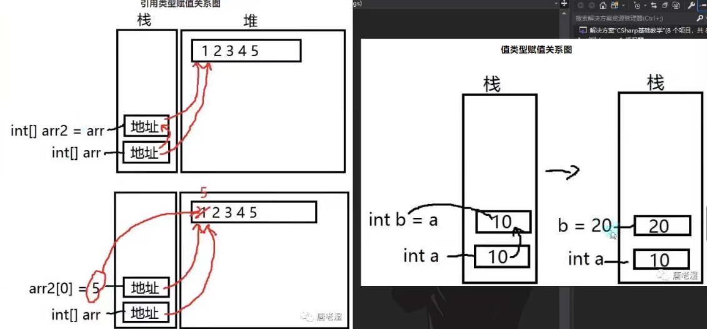
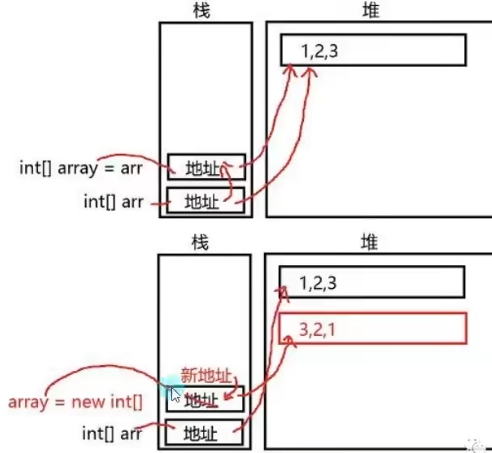
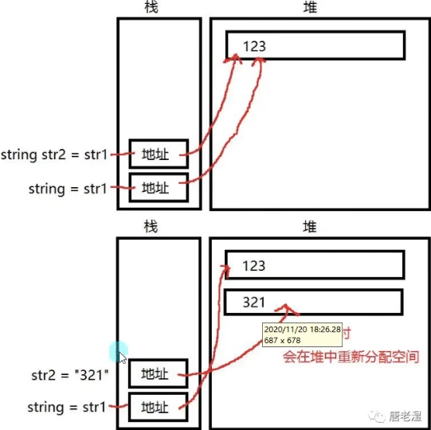

## 值类型和引用类型的区别

- [ ] 使用上的区别
```C#
值类型
int a = 10;
引用类型
int arr = new int[]{1,2,2,4};

int b = a;
int[] arr2 = arr;

Console.WriteLine("a = {0},b = {1}",a,b);
Console.WriteLine("arr[0] = {0},arr2[0] = {1}",arr[0],arr2[0]);

b = 20;
arr2[0] = 5;
Console.WriteLine("修改后的b和arr2[0]之后");
Console.WriteLine("a = {0},b = {1}",a,b);// b变a不变
Console.WriteLine("arr[0] = {0},arr2[0] = {1}",arr[0],arr2[0]); //都变。


```

- [ ] 为什么会有以上区别。
引用类型相互赋值会让两者指向同一个值，它变我也变。值类型则是将内容拷贝给对方。
值类型和引用类型存储在的内存区域是不同的。存储方式不同。

值类型存储在栈空间——是系统分配的内存空间，小而快
引用类型存储在堆空间，存在栈上的是指向堆空间的地址——手动申请和释放，大而快。

```C#
arr2 = new int[]{99,3,2,1};
// new就是开了新房间，和之前没关系了。
Console.WriteLine("arr[0] = {0},arr2[0] = {1}",arr[0],arr2[0]); 
```


## 特殊引用类型String
C#对String进行了一个特殊处理，具备值类型的特征，它变我不变。

所以频繁的使用string重新赋值会产生内存垃圾
优化方案：todo

## 前提回顾
值类型
无符号：byte,ushort,uint,ulong
有符号：sbyte,short,int,long
浮点数：float,double,decimal
特殊：char,bool
枚举：enum
结构体：struct

引用类型
string
数组
class
interface
委托

本质区别：
值类型的具体引用是在栈内存上
引用类型的具体内容是在堆内存上，在栈上面存的是地址，指向堆内存上的内容。

## 如何判断是值类型和引用类型
进到类的内部去看如果
是class就是引用
是struct就是值
还可以根据编译器的颜色，如vs中类是绿色

## 语句块
上层语句块：类，结构体
中层语句块：函数
底层语句块：条件分支 循环等

逻辑代码写在函数，条件分支，循环等中底层语句块中

我们的变量可以申明在：
上层语句块中：成员变量
中，底层语句块中：临时变量

## 变量的生命周期
语句块执行结束时
没有被记录的对象将被回收或变成垃圾
值类型：被系统自动回收
引用类型：栈上用于存地址的房间被系统自动回收，堆中具体内容变成垃圾，带系统GC

```C#
// 这里的b在语句块中，执行完之后就会在栈中被弹出
// 所以Console.WriteLine(b);会报错
// 所以语句块中的临时变量要经常进出栈，所以消耗大。
{
	int b = 1;
}
Console.WriteLine(b);
```
想要不被回收或者不变垃圾，需要将其记录下来
使用更高层级记录或者使用静态全局变量（可以不是自己类里的）记录。
