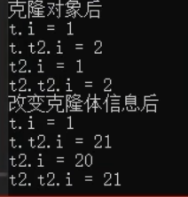

## 万物之父
万物之父Object是所有类型的基类，是一个引用类型，可以用里氏替换原则装载一切对象
## Object中的静态方法
- [ ] 静态方法Equal
 用于判断两个对象是否相等，判断值类型是否相等，引用类型是判断他们的地址是否相等。

- [ ] 静态方法ReferenceEquals
用来比较引用类型对象，比较的是地址，不能比较值类型对象，始终返回false;
## Object中的成员方法
- [ ] 普通方法GetType
该方法在反射知识点中是非常重要的方法。
该方法的主要作用就是获取对象运行时的类型Type
结合反射相关知识可以做很多关于对象的操作
```C#
// 假设上面定义了一个Test的类。
Test t = new Test();
Type type = t.GetType();
```
- [ ] 普通方法MemberwiseClone
```C#
class Test{ 
	// `i`的值（`1`）是存储在堆中的对象内部的。
	// 这里的int i不在栈上面存。会在托管堆
	public int i = 1;
	public Test2 t2 = new Test2();
	// 在Object中是保护类型
	public Test Clone(){
		return MemberwiseClone() as Test;
	}
}
class Test2{
	public int i = 2;
}

class Program{
	static void Main(string[] args){ 
		Console.WriteLine("万物之父中的方法");
		
		Test t = new Test();
		
		Test t2Clone = t.Clone();
		
		Console.WriteLine("克隆对象后");
		Console.WriteLine(t.i);
		Console.WriteLine(t.t2.i);
		Console.WriteLine(t2Clone.i);
		Console.WriteLine(t2Clone.t2.i);
	
		t2Clone.i = 20;
		t2Clone.t2.i = 21;
		Console.WriteLine("改变克隆体信息后");
		Console.WriteLine(t.i);
		Console.WriteLine(t.t2.i);
		Console.WriteLine(t2Clone.i);
		Console.WriteLine(t2Clone.t2.i);
	}
}
```



这里的 `Clone` 方法使用了 `MemberwiseClone` 进行浅拷贝，它会创建一个新的 `Test` 类对象，新对象中的i成员，会复制原对象对应的值，也就是 `t2Clone` 的 `i` 值初始为 `1`；而对于引用类型成员（此处的 `t2`），只是复制了引用，意味着 `t2Clone` 的 `t2` 成员和 `t` 的 `t2` 成员指向的是同一个 `Test2` 类对象实例。

`t2Clone.t2.i = 21;` 时，由于 `t2Clone` 的 `t2` 成员和 `t` 的 `t2` 成员指向同一个 `Test2` 类对象，所以对这个共享的 `Test2` 类对象中的 `i` 值进行修改后，通过 `t` 或者 `t2Clone` 去访问该 `Test2` 类对象的 `i` 值都会变为 `21`。

该方法用于获取对象的浅拷贝对象，就是会返回一个新的对象，但是只拷贝了栈上面的内容，就会拷贝到指向堆的那个地址，堆上面的内容没变，还是能够通过地址访问到。

值类型int 等等都是在要执行具体逻辑的那个类中比如static void Main(string\[] args)才会存在栈上面，而在类中申明的值类型变量不会，而是在类被实例化出来的时候会存在堆上。
## Object中的虚方法

- [ ] Equals方法
```C#
public override bool Equals(object obj){ 
	return base.Equals(obj)
}
```

- [ ] GetHashCode方法
```C#
public override int GetHashCode(){ 
	// 几乎不重写
	return base.GetHashCode();
}
```

- [ ] ToString()方法
```C#
public override string ToString(){
	return base.ToString();
}
```

## 练习
一个Monster类的引用对象A，Monster类有攻击力、防御力、血量、技能ID等属性。我想复制一个和A对象一模一样的B对象。并且改变了B的属性，A不会受到影响。请问如何实现？
思路：用浅拷贝或者深拷贝。
```C#
using System;

class Monster
{
    public int Attack { get; set; }
    public int Defense { get; set; }
    public int Health { get; set; }
    public int SkillID { get; set; }

    // 自定义克隆方法
    public Monster Clone()
    {
        // 使用MemberwiseClone进行浅拷贝
        Monster clone = (Monster)this.MemberwiseClone();
        // 如果有引用类型属性，需要在这里进行深拷贝处理
        // 例如，如果有一个List<int>类型的属性，如下处理
        // clone.ListProperty = new List<int>(this.ListProperty);
        return clone;
    }
}

class Program
{
    static void Main()
    {
        Monster A = new Monster
        {
            Attack = 10,
            Defense = 5,
            Health = 100,
            SkillID = 1
        };

        Monster B = A.Clone();
        B.Attack = 20;

        Console.WriteLine($"A的攻击力: {A.Attack}");
        Console.WriteLine($"B的攻击力: {B.Attack}");
    }
}
```


用深拷贝就实现ICloneable接口，（实现接口更加有范）
```C#
using System;

// Monster类
class Monster : ICloneable
{
    public int Attack { get; set; }
    public int Defense { get; set; }
    public int Health { get; set; }
    public int SkillID { get; set; }
    public List<int> SkillDamageList { get; set; }

    // 实现ICloneable接口的Clone方法
    public object Clone()
    {
        // 对Monster对象进行深拷贝
        Monster clone = new Monster
        {
            Attack = this.Attack,
            Defense = this.Defense,
            Health = this.Health,
            SkillID = this.SkillID
        };
        // 处理List<int>类型的属性
        if (this.SkillDamageList!= null)
        {
            clone.SkillDamageList = new List<int>(this.SkillDamageList);
        }
        return clone;
    }
}

class Program
{
    static void Main()
    {
        // 创建Monster对象A
        Monster A = new Monster
        {
            Attack = 10,
            Defense = 5,
            Health = 100,
            SkillID = 1
        };

        // 复制A得到B
        Monster B = (Monster)A.Clone();

        // 修改B的属性
        B.Attack = 20;

        // 输出A和B的属性
        Console.WriteLine($"A的攻击力: {A.Attack}");
        Console.WriteLine($"B的攻击力: {B.Attack}");
    }
}
```