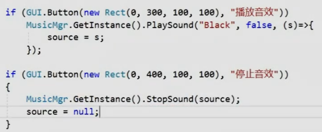

子物体传参数到父物体在SetLock方法里，

```C#
private void SetLock(int index,string name,int level)
```
父物体传参数在子物体的SetUIData方法中
```C#
Go.GetComponent<ArrayItem>().SetArrayItemUIData(SetLock, i, arrayList[i], arraySprites[i]);
```

如果要设置父子间按钮的绑定效果
可以给每个子物体加一个同样的效果
```C#
// 动态加载
private void InitWuShuPanelCallBack()
{
    for (int i = 0; i < TestWuShuList.Count; i++)
    {
        // 动态加载
        GameObject Go = Instantiate(m_Items);
        // 设置初始比例
        Go.transform.localScale = Vector3.one;
        // 父对象
        Go.transform.SetParent(Content);
        // 给每个加载出来的组件绑定按钮效果
        EventTriggerListener.Get(Content.GetChild(i).GetChild(0).GetComponent<Button>().gameObject).onClick = BtnDoubleCtrl;
    }
}
```
给法宝添加升级功能。


## 音效模块委托使用案例
s是加载出来的音效片段，通过委托传给source，在停止播放哪里再传过去停止。

```C#
using System.Collections;
using System.Collections.Generic;
using UnityEngine;
using UnityEngine.Events;

public class MusicMgr : BaseManager<MusicMgr>
{
    //唯一的背景音乐组件
    private AudioSource bkMusic = null;
    //音乐大小
    private float bkValue = 1;
    //音效依附对象
    private GameObject soundObj = null;
    //音效列表
    private List<AudioSource> soundList = new List<AudioSource>();
    //音效大小
    private float soundValue = 1;

    public MusicMgr()

    {

        MonoMgr.GetInstance().AddUpdateListener(Update);

    }
    private void Update()
    {
        // 倒着循环删除音效列表中的音效对象
        for( int i = soundList.Count - 1; i >=0; --i )
        {
            if(!soundList[i].isPlaying)
            {
                GameObject.Destroy(soundList[i]);
                soundList.RemoveAt(i);
            }
        }
    }
    /// <summary>
    /// 播放背景音乐
    /// </summary>
    /// <param name="name"></param>
    public void PlayBkMusic(string name)
    {
        if(bkMusic == null)
        {
            GameObject obj = new GameObject();
            obj.name = "BkMusic";
            bkMusic = obj.AddComponent<AudioSource>();
        }
        //异步加载背景音乐 加载完成后 播放
        ResMgr.GetInstance().LoadAsync<AudioClip>("Music/BK/" + name, (clip) =>
        {
            bkMusic.clip = clip;
            bkMusic.loop = true;
            bkMusic.volume = bkValue;
            bkMusic.Play();
        });
    }

    /// <summary>
    /// 暂停背景音乐
    /// </summary>
    public void PauseBKMusic()
    {
        if (bkMusic == null)
            return;
        bkMusic.Pause();
    }

    /// <summary>
    /// 停止背景音乐
    /// </summary>
    public void StopBKMusic()
    {
        if (bkMusic == null)
            return;
        bkMusic.Stop();
    }

    /// <summary>
    /// 改变背景音乐 音量大小
    /// </summary>
    /// <param name="v"></param>
    public void ChangeBKValue(float v)
    {
        bkValue = v;
        if (bkMusic == null)
            return;
        bkMusic.volume = bkValue;
    }
    /// <summary>
    /// 播放音效
    /// </summary>
    public void PlaySound(string name, bool isLoop, UnityAction<AudioSource> callBack = null)
    {
        if(soundObj == null)
        {
            soundObj = new GameObject();
            soundObj.name = "Sound";
        }
        //当音效资源异步加载结束后 再添加一个音效
        ResMgr.GetInstance().LoadAsync<AudioClip>("Music/Sound/" + name, (clip) =>
        {
            AudioSource source = soundObj.AddComponent<AudioSource>();
            source.clip = clip;
            source.loop = isLoop;
            source.volume = soundValue;
            source.Play();
            soundList.Add(source);
            if(callBack != null)
                callBack(source);
        });
    }
   /// <summary>
    /// 改变音效声音大小
    /// </summary>
    /// <param name="value"></param>
    public void ChangeSoundValue( float value )
    {
        soundValue = value;
        for (int i = 0; i < soundList.Count; ++i)
	        soundList[i].volume = value;
    }

    /// <summary>
    /// 停止音效
    /// </summary>
    public void StopSound(AudioSource source)
    {
        if( soundList.Contains(source) )
        {
	        soundList.Remove(source);
            source.Stop();
            GameObject.Destroy(source);
        }
    }
}
```