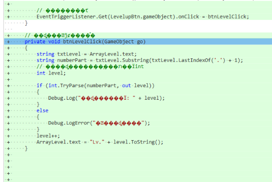

子物体传参数到父物体在SetLock方法里，

```C#
private void SetLock(int index,string name,int level)
```
父物体传参数在子物体的SetUIData方法中
```C#
Go.GetComponent<ArrayItem>().SetArrayItemUIData(SetLock, i, arrayList[i], arraySprites[i]);
```

如果要设置父子间按钮的绑定效果
可以给每个子物体加一个同样的效果
```C#
// 动态加载
private void InitWuShuPanelCallBack()
{
    for (int i = 0; i < TestWuShuList.Count; i++)
    {
        // 动态加载
        GameObject Go = Instantiate(m_Items);
        // 设置初始比例
        Go.transform.localScale = Vector3.one;
        // 父对象
        Go.transform.SetParent(Content);
        // 给每个加载出来的组件绑定按钮效果
        EventTriggerListener.Get(Content.GetChild(i).GetChild(0).GetComponent<Button>().gameObject).onClick = BtnDoubleCtrl;
    }
}
```
给法宝添加升级功能。
