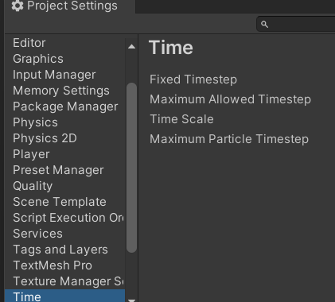
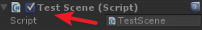

```C#
public class ssss : MonoBehavier
{
	void Awake(){
	}
	// 脚本可用时候执行
	void OnEnable(){
	}
	// 脚本禁用时候执行
	void OnDisEnable(){
	}
	void Start(){
	}
	void Update(){
	}
	// Update之后执行
	void LateUpdate(){
	}
	// 固定时间间隔执行
	void FixedUpdate(){
	}
	// 销毁的时候执行
	void OnDestory(){
	}

}
```
FixedUpdate位置

enable是这个勾启用禁用时候执行。

##### Mathf常用方法
```C#
Mathf.Clamp();// 限制在一个范围区间
Mathf.Lerp();// 差值
Mathf.Round();// 四舍五入
Mathf.Abs();// 绝对值
```