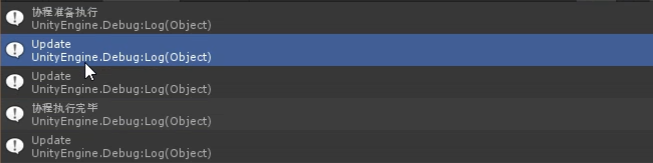

##### 启动协程
```C#
void Start()
{
	StartCoroutine(Test());
}


private IEnumerator Test()
{
	Debug.Log("协程准备执行");
	yield return 0; // 在下一帧中执行
	//yield return WaitForSeconds(2f); // 等待几秒后执行
	Debug.Log("协程执行完毕");
}

void Update()
{
	Debug.Log("Update");
}
```
输出

##### 中止协程
```C#
void Update()
{
	if(Input.GetKeyUp(LeyCode.B))
	{
		// 停止该脚本上所有的协程
		stopAllCoroutines();
	}
}
```