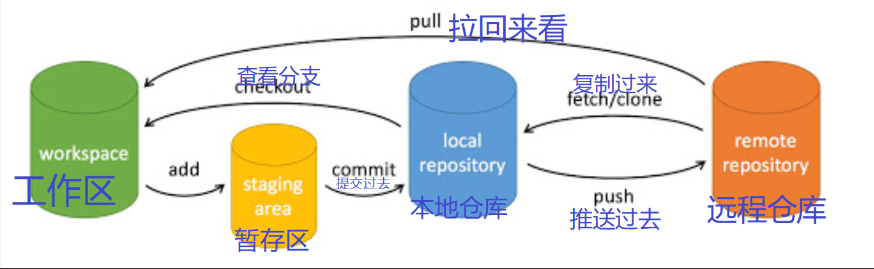

### 前言
虽然配置好了，整个过程属于是非常懵，思考了许久决定将建站历程记录下来，相信如果你是一个没建过网站的人，那你可能会想我一样先找找有没有关于的搭建的过程。不过很不幸，这篇博客更多是为了记录和提醒自己，如果你要是完全按照这个不一定搞得出来。可以借鉴的地方是关于让图片能够在博客的 文章中显示出来的内容，因为这一块我网上没有找到跟我一样的，是自己摸索的。

## 原理
```
hexo clean # 清除缓存文件，建议写完文章后执行一次
hexo g		# 生成 public 文件夹，写完文章执行
hexo s		# 启动 hexo 服务,部署本地服务器上
```
先来了解下原理hexo g命令是直接生成静态页面，对应public文件夹
hexo d则是hexo提供的推送方法，是直接将生成的静态资源推送到远程仓库的。所以这个时候不用本地仓库也能运行，自然也起不到版本管理的目的，
注意这里的推送应该是有个条件，就是自己的仓库名和自己填写的网页的名称是一致的。

后面我们需要在Obsidian中装Git插件则需要我们在博客根目录下面创建一个本地仓库 ，这个时候我们推送的是整个博客文件，方便我们进行版本管理。
```
git init
```
之后再进行仓库之间的推送与拉取

安装Hexo
安装过程中要设置终端中管理员模式，不然指不定报错
```
npm install -g hexo-cli # 全局安装  
hexo -v # 查看hexo版本
```
I:\HexoBlog\blog目录下
```
hexo init
```

安装 主题
在根目录下右键 Git bash
```
git clone https://github.com/yelog/hexo-theme-3-hexo.git themes/3-hexo
```
修改hexo根目录的`_config.yml`，如下
```yaml
theme: 3-hexo
```

这里知道什么是GitBash
1. **Git Bash 与控制台的区别**
    - **Git Bash**：
        - **本质和功能特点**：Git Bash 是在 Windows 环境下模拟 Linux 命令行环境的工具，主要用于方便开发者在 Windows 系统中使用 Git 相关命令。它基于 MSYS2（一个类 Unix 的环境），提供了许多常见的 Linux 命令，如`ls`（列出目录内容）、`cd`（切换目录）、`grep`（文本搜索）等，同时也能很好地支持 Git 命令，如`git clone`、`git commit`、`git push`等。
        - **用户体验方面**：对于熟悉 Linux 或 macOS 命令行操作的用户来说，Git Bash 的操作方式比较熟悉。它的界面相对简洁，是一个纯文本的命令行界面。用户可以通过输入命令来完成各种版本控制和文件系统操作，例如创建仓库、管理分支、提交和推送代码等。
    - **控制台（Windows 命令提示符或 PowerShell）**：
        - **本质和功能特点**：Windows 命令提示符（`cmd.exe`）是 Windows 操作系统自带的原生命令行工具，主要用于执行 Windows 系统的内部命令和可执行文件。它可以进行基本的文件和目录操作，如`dir`（列出目录内容，相当于 Git Bash 中的`ls`）、`cd`（切换目录）等，也可以运行一些 Windows 程序。PowerShell 是比命令提示符更强大的命令行环境，它不仅能执行基本的命令，还可以处理对象和脚本，支持管道操作等高级功能，并且可以更好地管理系统资源和自动化任务。
        - **用户体验方面**：命令提示符的命令语法相对简单，更符合 Windows 操作系统的传统风格。PowerShell 则提供了更丰富的功能和更灵活的脚本编写能力，但学习曲线可能稍陡一些。与 Git Bash 相比，它们在命令语法和功能重点上有所不同。例如，Git Bash 中的一些 Linux 命令在 Windows 控制台中可能无法直接使用，需要使用对应的 Windows 命令来替代。
2. **Git GUI 介绍**
    - **本质和功能特点**：Git GUI 是一个图形用户界面工具，用于管理 Git 仓库。它提供了一种可视化的方式来执行 Git 操作，而不是通过输入命令来完成。例如，用户可以通过 Git GUI 直观地看到仓库中的分支结构，通过点击按钮来进行提交、推送、拉取、合并分支等操作，还可以查看提交历史记录等信息。一些常见的 Git GUI 工具包括 GitKraken、SourceTree 等，也有 Git 自带的简单 GUI 工具（如`git gui`命令启动的界面）。
    - **用户体验方面**：对于不熟悉 Git 命令行操作或者更喜欢可视化操作的用户来说，Git GUI 提供了更友好的体验。它将复杂的 Git 操作转化为直观的图形界面操作，减少了记忆命令和语法的负担。例如，在合并分支时，通过 Git GUI 可以清晰地看到两个分支的差异，选择要合并的内容，而在命令行中则需要准确地输入`git merge`命令及相关参数。不过，Git GUI 可能在某些复杂场景下灵活性不如命令行，并且可能占用更多的系统资源。
## 完成部署
这里在github需要设置什么密钥，我之前就搞定过了，但是记得不是很清楚，而这个搭建过程中我都没有相关的操作，所以不多写了。
登录 GitHub，新建一个 Repository，`Repository name`一定要是`你的用户名`.github.io
dexo支持一键部署，（hugo你看看你）。

一键部署 | Hexo

 1.安装 hexo-deployer-git。
```
$ npm install hexo-deployer-git --save
```
2.编辑 **_config.yml**
```yml
deploy:  
  type: git  
  repo: <repository url> # https://bitbucket.org/JohnSmith/johnsmith.bitbucket.io  
  branch: [branch]  
  message: [message]
```
有些不填也行,下面是我的配置
```
# Deployment
## Docs: https://hexo.io/docs/one-command-deployment
deploy:
  type: git
  repo: https://github.com/Bigcollegefw/Bigcollegefw.github.io.git
  branch: main
```
## 让照片直接能够显示
这里我的目的是我在Obsidian编辑过程中能够直接复制出来的图片，不需要任何别的操作就能够被网页中正确显示，很幸运，我成功了。
hexo根目录的img文件夹需要和主题的img文件夹一致图片才能读取到

刚复制出来的图片是不会直接显示的，必须等hexo g之后才可以


## 设置ObsidianGit进行管理控制
这里不用设置都可以，但是推送后可以进行一个备份不会丢。换电脑了可以直接pull回来。
在根目录GitBash中执行如下代码
```
git init#初始化一个git仓库
```

这图并不准确
1. **`git pull`拉回文件的存放位置**
	当你执行`git pull`操作时，拉取回来的文件会先更新到本地仓库，然后 Git 会自动将本地仓库中的更改合并到工作区。也就是说，最终你在本地工作区看到的文件是经过合并后的结果。
2. **工作区的位置**
    工作区就是你在本地电脑上克隆或初始化 Git 仓库的那个目录。例如，如果你通过`git clone [远程仓库地址] [本地目录名]`克隆了一个远程仓库，那么这个`[本地目录名]`所对应的目录就是工作区。
	如果你是在本地直接使用`git init`初始化一个仓库，那么当前所在的目录就是工作区。工作区包含了项目的所有文件（除了隐藏的`.git`目录，它属于本地仓库的一部分），这些文件是你日常编辑、查看和操作的对象。
3. **“查看分支（checkout）**
	箭头方向 在图中，从 “本地仓库（local repository）” 到 “暂存区（staging area）” 有一个 “查看分支（checkout）” 的箭头。通常情况下，`git checkout`操作是从本地仓库检出分支到工作区，而不是到暂存区。正确的方向应该是从本地仓库指向工作区。
 4. **“拉回看（pull）” 的表述“拉回看（pull）”** 
	这种表述不太常见和准确。在 Git 中，`git pull`是一个组合操作，等同于`git fetch`加上`git merge`（或者`git rebase`，取决于配置），其主要作用是从远程仓库获取最新的更改并合并到本地仓库，进而可能影响工作区。
 5. **“复制过来（fetch/clone）” 的表述**
	 “复制过来（fetch/clone）” 这种表述比较模糊。`git fetch`是从远程仓库获取最新的提交，但不会自动合并到本地仓库；`git clone`是复制整个远程仓库到本地。这两个操作有本质区别，在图中可以考虑更明确地分开表示或者详细说明它们的不同作用。
6. **“提交过去（commit）” 的箭头方向**
	从 “暂存区（staging area）” 到 “本地仓库（local repository）” 的 “提交过去（commit）” 箭头是正确的，但可能需要强调一下只有在暂存区有内容时，`git commit`操作才会将暂存区的内容提交到本地仓库。

受政治影响，原来的主分支为master改为main,有时候推送会报错，
如果上面写的分支为master则改为mian
```bash
git branch -M main
```

关联远程仓库
```
git remote add origin https://github.com/Bigcollegefw/blog.git
```

出现如下提示则关联上了


使用这个的前提是在博客根目录下初始化了仓库有.git文件

接着这个的使用步骤就是
第一个是commit and sync，就是commit和push
第二个是pull。

不想手动就自动

在你的 hexo 项目的 .gitignore 文件中加入如下内容：
```
.obsidian/workspace
```
> .obsidian 文件本身是可以同步的，当前存储库的插件以及相关的配置都会下载在这个文件夹中，因此将其同步到 git 记录中也是非常有用的，假如你切换设备就不需要重新为当前的存储库重新配置 Obsidian 了。


参考：
[关于我使用obsidian加hexo部署个人博客的过程 - SagiRastar's Blog](https://sagi-rastar.github.io/2023/11/10/%E5%85%B3%E4%BA%8E%E6%88%91%E4%BD%BF%E7%94%A8obsidian%E5%8A%A0hexo%E9%83%A8%E7%BD%B2%E4%B8%AA%E4%BA%BA%E5%8D%9A%E5%AE%A2%E7%9A%84%E8%BF%87%E7%A8%8B/)
[Hexo + Obsidian + Git 完美的博客部署与编辑方案 - 个人文章 - SegmentFault 思否](https://segmentfault.com/a/1190000042111566)


