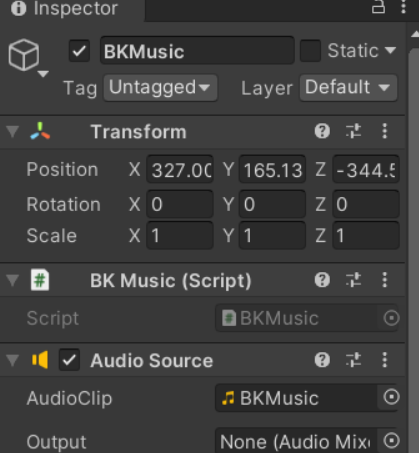
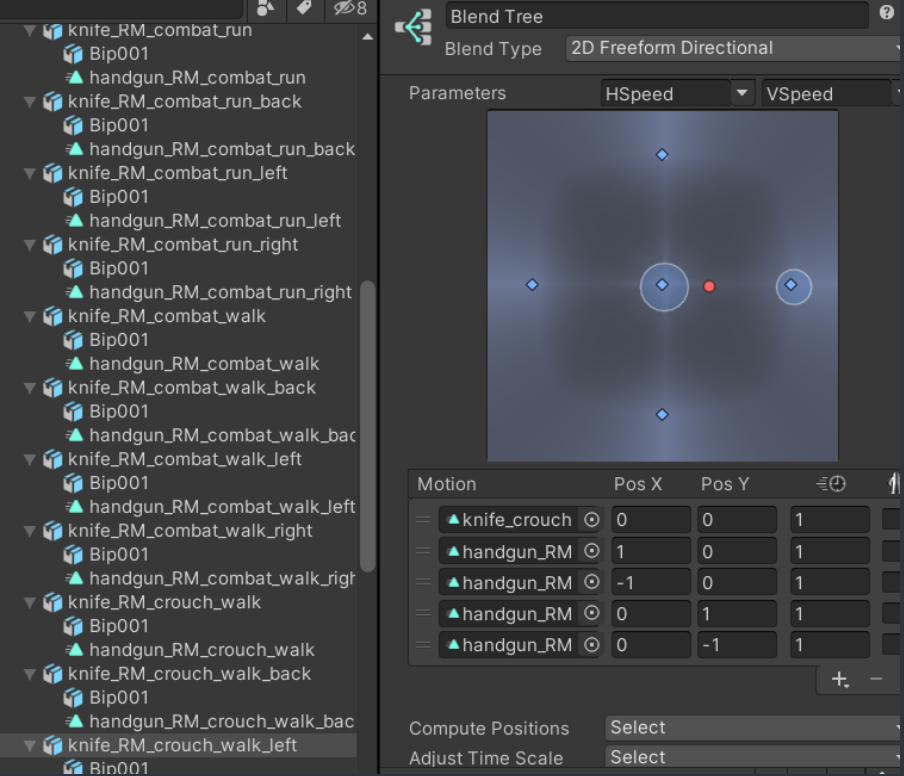

大致记录下具体流程与详细知识点。估计之后的项目笔记也不会再记得这么详细了​。因为有点多就分了上下两篇。左上角有个按钮可以切换到大纲。

首先用2019版创建一个3D核心项目
## 1.先拖入场景并且制作面板
UIManager中，为了保证全局都能够找到一个Canvas,所以将canvas做成一个预设体1

找到人物资源，并且放入对应的动画，一个啃食一个在趴着

### BasePanel
```C#
using System;
using System.Collections;
using System.Collections.Generic;
using UnityEngine;
using UnityEngine.Events;

public abstract class BasePanel : MonoBehaviour
{
    
    // 专门用于控制面板透明度的组件
    private CanvasGroup canvasGroup;
    // 淡入淡出的速度
    private float alphaSpeed = 10;
    // 当前是隐藏还是显示
    public bool isShow = false;
    
    // 当隐藏完毕后想要做的事情，委托。
    private UnityAction hideCallBack = null;

    // 保护类型的虚函数，是确保子类可以重写这个虚函数，用public是可以在外面执行的时候可以点出来
    // 但是这种生命周期函数是不需要手动调用，所以不用public而是用protected，在父类和子类之间可以使用就可以了。
    protected virtual void Awake()
    {
        // 获取面板上挂载的组件
        canvasGroup = this.GetComponent<CanvasGroup>();
        if (canvasGroup == null)
        {
            canvasGroup = this.gameObject.AddComponent<CanvasGroup>();
        }
    }

    // Start is called before the first frame update
    protected virtual void Start()
    {
        Init();
    }

    
    /// <summary>
    /// 注册控件事件的方法，所有的字面板都需要去注册一些控件事件
    /// 所以写成抽象方法，让子类必须去实现
    /// </summary>
    public abstract void Init();

    /// <summary>
    /// 显示自己做的函数
    /// </summary>
    public virtual void ShowMe()
    {
        canvasGroup.alpha = 0;
        isShow = true;
    }

    /// <summary>
    /// 影藏自己的方法
    /// </summary>
    public virtual void HideMe( UnityAction callBack)
    {
        canvasGroup.alpha = 1;
        isShow = false; 
        
        hideCallBack = callBack;
    }
    
    // Update is called once per frame
    void Update()
    {
        // 实现淡入淡出的效果
        if (isShow && canvasGroup.alpha != 1)
        {
             canvasGroup.alpha += alphaSpeed * Time.deltaTime;  
             if(canvasGroup.alpha >= 1)
                 canvasGroup.alpha = 1;         
        }
        // 淡出
        else if (!isShow && canvasGroup.alpha != 0)
        {
            canvasGroup.alpha -= alphaSpeed*Time.deltaTime;
            if (canvasGroup.alpha <= 0)
            {
                canvasGroup.alpha = 0;
                // 让面板透明度淡出完成后，再去执行的一些逻辑
                // 如果 hideCallBack 不为 null，那么就会执行它所封装的方法
                hideCallBack?.Invoke(); 
            }

        }
    }
}
```

每个继承BasePanel的面板都会有一个必须实现的方法Init();和几个可以改写的方法就是那些带 virtual的方法,不改写就默认父类的操作
### UIManager
```C#
using System.Collections;
using System.Collections.Generic;
using UnityEngine;

public class UIManager
{
    private static UIManager instance = new UIManager();
    public static UIManager Instance => instance;

    // BasePanel是米氏替换原则，基类替换。用于存储显示着的面板，每显示一个面板，就会存入这个字典。
    // 影藏面板的时候就会直接获取字典中的对应面版进行隐藏。
    private Dictionary<string, BasePanel> panelDic = new Dictionary<string, BasePanel>();

    // 场景中的 Cancas对象,用于设置面板的父对象。
    private Transform canvasTrans;

    // 单例模式构造函数就会执行一次，所以用构造函数
    private UIManager()
    {
        // 得到场景中的Canvas对象
        GameObject canvas = GameObject.Instantiate(Resources.Load<GameObject>("UI/Canvas"));
        canvasTrans = canvas.transform;
        // 通过场景时候不移除该对象，保证这个游戏过程中只有一个canvas对象。 
        GameObject.DontDestroyOnLoad(canvas);
    }

    // 显示面板
    public T ShowPanel<T>() where T : BasePanel
    {
        // 保证泛型T的类型和面板预设体名字一样。
        string panelName = typeof(T).Name;

        if (panelDic.ContainsKey(panelName))
            return panelDic[panelName] as T;

        // 显示面板，创建实例，设置父对象。
        GameObject panelObj = GameObject.Instantiate(Resources.Load<GameObject>("UI/" + panelName));
        // 把这个对象放到场景中Canvas下面
        panelObj.transform.SetParent(canvasTrans, false);

        // 获得这个泛型类面板的组件，存进字典。
        T panel = panelObj.GetComponent<T>();
        panelDic.Add(panelName, panel);
        // 通过BasePanel中方法显示。
        panel.ShowMe();

        return panel;
    }

    // 隐藏面板
    // 需要考虑是直接淡入淡出还是直接删
    public void HidePanel<T>(bool isFade = true) where T : BasePanel
    {
        // 根据泛型得到名字
        string panelName = typeof(T).Name;
        // 判断当前显示的面板，有没有你想要隐藏的 。
        if (panelDic.ContainsKey(panelName))
        {
            if (isFade)
            {
                panelDic[panelName].HideMe(() =>
                {
                    // 删除对象
                    GameObject.Destroy(panelDic[panelName].gameObject);
                    // 删除字典里面存储的面板脚本
                    panelDic.Remove(panelName);
                });
            }
            else
            {
                // 删除对象
                GameObject.Destroy(panelDic[panelName].gameObject);
                // 删除字典里面存储的面板脚本
                panelDic.Remove(panelName);
            }
        }
    }

    // 得到面板
    public T GetPanel<T>() where T : BasePanel
    {
        string panelName = typeof(T).Name;
        if(panelDic.ContainsKey(panelName))
            return panelDic[panelName] as T;

        return null;
    }
}
```
创建好面板后写开始面板逻辑，注意命名和Hierachy中一致

做好之后将这个脚本拖到BenginPanel下，然后将对应的按钮放到脚本组件下，再将BeginPanel做成一个预设体，然后就可以将这两个都删掉了。

## 2.创建一个Main，挂载主入口Main脚本。
## 拼SettingPanel面板

## 3.编写背景音乐数据脚本
### MusicData
存储和读取音乐相关的数据

## 4.添加一个专门用来管理数据的类
### GameDataMgr
提供了读取数据，斌且保存数据的方法给外部使用。

`private GameDataMgr()`构造函数主要在首次访问`GameDataMgr`类的静态成员或者存在对其内部已初始化数据的依赖关系被首次触发时执行，以创建`GameDataMgr`类的实例并完成相关数据的初始化。这里关于的Json相关内容，不赘述。

## 5.专门创建一个脚本来控制背景音乐的开关和大小
这个脚本需要挂载到场景上，我们又希望无论在什么时候我们都能够去访问到它，所以我们写成单例模式


### BKMusic
在场景中添加一个空物体来挂载这个脚本。

管理场景中的背景音乐，提供方法让外面来控制背景音乐的开关和大小。且是单例模式

## 6.编写设置面板脚本逻辑

将组件挂载到同名面板上，该拖的东西拖上去。

### SettingPanel
这里面与BKMusic结合来控制背景音乐的大小和开关，因为音效这个东西是在BKMusic的AudioSource组件上面挂着的。
与GameDataMgr结合来将设置的数据保存到本地，下次打开直接就是从本地拿出来。


在BeginPanel'中点击显示会显示设置面板


## 7.摄像机动画

选中摄像机

创建文件
调整出来一种上下缓缓的浮动。
接着新建一个左转的动作，右转的动作。

最后摄像机动画效果


### 动画脚本CameraAnimator

为了知道什么时候动画播放完了，然后来控制选角面板和开始面板的出现。在动画中加事件。

游戏开始的时候点击开始实现左转的方法同时传进去一个函数，这个函数会在事件容器中存下来之后在PlayerOver中等动画播放完了之后再调用。

然后就是这段代码的使用，我们要在BeginPanel中使用

## 8.拼人物选角面板

成果：

## 9.角色资源准备
将装好武器的人新做一个预制体。
接着做人物的状态机


### 人物射击动画          
需要用到人物的遮罩
上面的设计动画和下半身移动需要分开做。
建立人物的遮罩Mask


### 人物蹲着动画
做按住Ctrl键人物会蹲着走的动作。
到时候只需要代码设置这个层级的Weight权重就可以实现蹲着走了


### 做其余5个角色的状态机
用状态机的复用

其余都是一样的。拖动。

## 10.配置人物模型的数据
采用Json相关数据表来配置相关新鲜文件夹来编辑。
RoleInfo中
转成json
在StreamingAssets里面创建。
这样角色数据表就准备好了。
接着需要有一个对应的数据结构类来装载这些数据。


玩家运行时候记录当前已经解锁角色的数据。

GameDataMgr中读取数据
一个是roleInfoList，一个是playerData
`注意`这里我的读取角色数据下面写错了,是RoleInfo应与Unity中的Assets/Scripts/Data/RoleInfo.cs一致,不是RoleInfoList
## 11.选角面板逻辑
新建脚本继承BasePanel实现抽象方法，拖入控件实现控件逻辑。

确定角色动态出现的位置
新建一个空物体HeroPos
在BeginPanel加一个显示,方便后面测试人物选择面板

### ChooseHeroPanel

#### 左右键变换角色的逻辑

#### 解锁按钮显示和隐藏和开始按钮显示和隐藏

#### 解锁按钮的购买逻辑

#### 点击开始和返回按钮逻辑
首先得在GameDataMgr中记录下选好的人物.
逻辑：

#### 返回后人物没销毁bug
然后发现点击返回后再开始人物没有去销毁
修改方式可以重写BasePanel中的HideMe方法,因为再UIManager.Instance.HidePanel中就会用到BasePanel的HideMe方法.而HideMe方法就是可以重写的.
至于这里为什么要base.HideMe(callback),我想应该是为了和父类的方法保持一致,因为隐藏的时候就是用HidePanel<>()并没有传入(bool isFade = true) ,所以默认是true。
而这个callback就是为了淡入淡出准备的事件:HideMe里面的事件(callBack)就是删除对象和字典里面的面板脚本,而HideMe里面除了设置事件的方法外还有能够控制淡入的条件设置。

## 13.拼提示界面

## 14.提示面板逻辑和使用
因为继承了BasePanel所以可以使用UIManager来全局生成。


使用的时候直接再ChooseHeroPanel中需要的地方直接使用且调用ChangeInfo方法。

## 15.拼场景选择页面
和人物选择界面有相同点，直接拿人物选择界面来更改。

## 16.场景选择面板的数据准备
新建数据表


准备数据类

在GameDataMgr中读取

## 17.场景选择界面逻辑
首先在ChooseHeroPanel中将点击开始后进入场景选择界面的逻辑加上
需要将图片的类型转换成Sprite类型

### ChooseScenePanel
大致逻辑，和ChooseHeroPanel有异曲同工之妙

这里的切换对应场景等做了游戏场景再补充。


