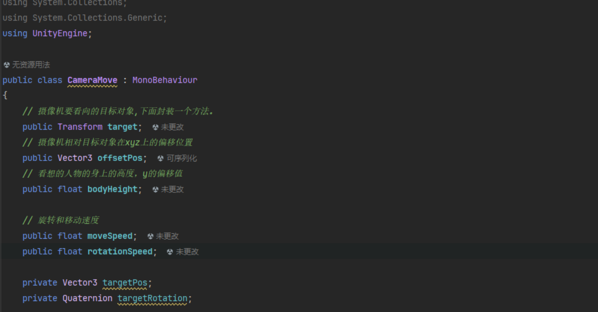

## 场景准备
### 烘焙一下地形
怪物需要自动寻路
将所有子对象改成烘焙的静态
然后就可以烘培了
发现有很多地方看着能走结果走不了。将半径调整小即可。

发现草树叶上面很多东西都有许多地方生成了可心走区域，这些地方应该是可以穿过的。
调整方式：将Vegitation的静态烘培取消。

然后发现有许多树又可以闯过了，可以在Vegitation下面进行微调。
## 拼游戏界面的UI
Bot这个空物体的锚点设置下方拉伸，这样下面这一部分就可以随分辨率的不同而变化宽度。为什么不用panel,因为Empty携带的信息更少，更节约。
## 游戏界面脚本逻辑

#### GamePanel脚本
会去管理TowerBtn复合控件的脚本，并且会关系游戏面板中的各种控件。

提供三个方法进行UI更新

#### TowerBtn组合控件的脚本
后续有了防御塔数据再来完善。

## 编写摄像机脚本
实际上就是计算摄像机的距离。



## 玩家逻辑
玩家动画状态机的控制，玩家的攻击方式的检测，玩家提供的初始化属性的方法给外部，然后再从之前表里的取出数据。

因为前后左右身子朝前的，人物不会转向所以需要转身需要一个旋转的速度。

进行拿枪的人物的射线检测需要给每个枪口添加一个空物体gunPoint,同时攻击检测需要在每一个角色的对应攻击动画下面去添加一个事件。刀对应KnifeEvent,枪对应ShootEvent。

### PlayerObject

Update中实现对应状态机的控制
刀攻击为范围检测，枪攻击为射线
钱相关的方法。

## 保护区区域逻辑
拖入特效时候草与特效接触地方有面片，解决办法
创建脚本

进行伤害检测的方法。

### MainTowerObject
为了能够被敌人获取到位置，将其设置为单例模式，但是这种单例模式在过场景时候仍然会保持引用的，所以需要将其换场景的时候销毁掉
创建敌人状态机


注意其中的Null到Atk和Wound的转换条件中需要将Dead设置为false.
为了让受伤攻击的动作更加明显点，这里的转换事件TransitionDuration设置为0。

为了构建多套动画随机分配给丧尸们，新建一个Animator Override Cotroller拖入对应的不同动画。

## 怪物数据配置
接着带Data文件夹下面创建对应数据脚本结构，再在GameData中去读取它。

GameDataMgr中

## 怪物的行为逻辑


### MonsterObject


这两个函数都需要再Unity中的对应出生和死亡动画中绑定动画事件

代码太长设置了下自动换行
###  在PlayerObject中添加怪物受伤


## 设置出怪点的逻辑
特效在这下面找

创建脚本

### MonsterPoint


最后将脚本拖到对应的特效出生点上面。

## 游戏关卡管理器
这个代码写的串了一堆
### GameLevelMgr.cs
1.是切换到游戏场景时 我们需要动态的创建玩家，同时初始化页面
2.2.我们需要通过游戏管理器 来判断 游戏是否胜利
```C#
using System.Collections;  
using System.Collections.Generic;  
using UnityEngine;  
  
public class GameLevelMgr  
{  
    private static GameLevelMgr instance = new GameLevelMgr();  
    public static GameLevelMgr Instance => instance;  
  
    public PlayerObject player;  
  
    // 所有的出怪点  
    private List<MonsterPoint> points = new List<MonsterPoint>();  
    // 记录当前 还有多少波怪物  
    private int nowWaveNum = 0;  
    // 记录 一共有多少波怪物  
    private int maxWaveNum = 0;  
  
    // 记录当前场景上的怪物数量  
    private int nowMonsterNum = 0;  
  
    private GameLevelMgr()  
    {  
    }  
    // 1.是切换到游戏场景时 我们需要动态的创建玩家  
    public void InitInfo(SceneInfo info)  
    {        // 显示游戏界面  
        UIManager.Instance.ShowPanel<GamePanel>();  
  
        // 玩家的创建  
        // 获取之前记录的当前选中的玩家数据  
        RoleInfo roleInfo = GameDataMgr.Instance.nowSelRole;  
        // 首先获取到场景当中 玩家的出生位置  
        Transform heroPos = GameObject.Find("HeroBornPos").transform;  
        // 实例化玩家预设体 然后把它的位置角度 设置为 场景当中出生点一致  
        GameObject heroObj = GameObject.Instantiate(Resources.Load<GameObject>(roleInfo.res), heroPos.position, heroPos.rotation);  
        // 对玩家对象进行初始化  
        player = heroObj.GetComponent<PlayerObject>();  
        // 初始化玩家的基础属性,这里的Money是刚进入游戏玩家拥有的金币数量，配置在SceneInfo中即可  
        player.InitPlayerInfo(roleInfo.atk, info.money);  
        // 让摄像机 看向动态创建出来的玩家  
        Camera.main.GetComponent<CameraMove>().SetTarget(heroObj.transform);  
  
        // 初始化 中央 保护区域的血量  
        MainTowerObject.Instance.UpdateHp(info.towerHp, info.towerHp);  
    }  
    // 2.我们需要通过游戏管理器 来判断 游戏是否胜利  
    // 要知道 场景中 是否还有怪物没有出 以及 场景中 是否有还没有死亡的怪物  
  
    // 用于记录出怪点的方法  
    public void AddMonsterPoint(MonsterPoint point)  
    {        points.Add(point);  
    }  
    /// <summary>  
    /// 更新一共有多少波怪  
    /// </summary>  
    /// <param name="num"></param>    public void UpdatgeMaxNum(int num)  
    {        maxWaveNum += num;  
        nowWaveNum = maxWaveNum;  
        //更新界面  
        UIManager.Instance.GetPanel<GamePanel>().UpdateWaveNum(nowWaveNum, maxWaveNum);  
    }  
    /// <summary>  
    /// 随游戏进行更新波数  
    /// </summary>  
    /// <param name="num"></param>    public void ChangeNowWaveNum(int num)  
    {        nowWaveNum -= num;  
        // 更新界面  
        UIManager.Instance.GetPanel<GamePanel>().UpdateWaveNum(nowWaveNum, maxWaveNum);  
    }  
    /// <summary>  
    /// 检测 是否胜利  
    /// </summary>  
    /// <returns></returns>    public bool CheckOver()  
    {        for (int i = 0; i < points.Count; i++)  
        {            // 只要有一个出怪点 还没有出完怪  那么久证明还没有胜利  
            if (!points[i].CheckOver())  
                return false;  
        }  
        if (nowMonsterNum > 0)  
            return false;  
  
        Debug.Log("游戏胜利");  
        return true;  
    }  
    /// <summary>  
    /// 改变当前场景上怪物的数量  
    /// </summary>  
    /// <param name="num"></param>    public void ChangeMonsterNum(int num)  
    {        nowMonsterNum += num;  
    }}
```

涉及到场景的切换首先需要进行下面的操作。

#### ChooseScenePanel
在ChooseScenePanel中先把切换场景的功能加上
但是这个同步加载关卡管理器的话容易报错，因为可能下个场景还没有完全加载结束就执行关卡初始化了，导致HeroBornPos找不到
更改为：

#### GameScene
在GameScene中添加玩家的出生位置


在SceneInfo中多配置一个开场拥有的钱和塔的血量
```
[
{"id":1,"imgRes":"SceneImg/GameScene1","name":"疯狂树林","tips":"辣辣","sceneName":"GameScene1","money":200," towerHp":200},
{"id":2,"imgRes":"SceneImg/GameScene2","name":"礼拜教堂","tips":"哈哈","sceneName":"GameScene2","money":200," towerHp":200},
{"id":3,"imgRes":"SceneImg/GameScene3","name":"阴森墓地","tips":"好好","sceneName":"GameScene3","money":200," towerHp":200}
]
```
#### ChooseHeroPanel
在ChooseHeroPanel中设置开始页面不能操作角色

####  MonsterPoint
在MonsterPoint中
联合Game LevelMgr的方法管理出怪
怪物生成了告诉关卡管理器数量加1

#### MonsterObjects
MonsterObjects中：死了告诉关卡管理器数量减1，顺便检查下游戏结束没。

#### PlayerObject
PlayerObject中完善人物攻击检测


## 结束界面
拼结束界面

写对应脚本

在GameLevelMgr中，清空记录

在点游戏界面上的返回时也需要清空下
MainTowerObject中完善游戏结束弹出页面

MonsterObject中完善游戏胜利弹出结束页面

这里补充了一个C#基础知识点
**`GameOverPanel panel;`**
- 这只是声明了一个`GameOverPanel`类型的变量`panel`。此时`panel`没有被实例化，它的值为`null`。
- 就好比你只是在告诉编译器，“我会有一个`GameOverPanel`类型的东西，先给我留个位置来存放它的引用”。这个变量占用了内存空间，但它还没有指向任何实际的`GameOverPanel`对象。
**`GameOverPanel panel = new GameOverPanel();`**
- 这不仅声明了`GameOverPanel`类型的变量`panel`，还通过调用`GameOverPanel`类的构造函数创建了一个新的`GameOverPanel`对象，并让`panel`变量立即指向这个新创建的对象。
- 构造函数（`new`操作符会调用的）负责初始化对象的状态，比如设置初始属性值、分配内部资源等。例如，`GameOverPanel`类可能有如下构造函数：
## 鼠标的锁定
GamePanel中

GameOverPanel中

## 音效特效添加
资源文件

在GameDataMgr中添加这个方法。这个随便放在一个单例模式的类下都可以应该。

PlayerObject中添加攻击音效


在怪物的MonsterObject脚本中添加死亡音效，和受伤音效，攻击音效
现在有两个疑问，1：这个设置中的音效的大小是怎么控制的
2：我的刀的攻击音效并没有显示出来。是我的Kinfe拼错了。

## 攻击特效
开火打击特效

 

PlayerObject中


## 防御塔数据模型准备
数据：

Resources下配置好塔和图片

配置数据TowerInfo
在GameDataMgr中读取出来。参考之前。

## 防御塔逻辑
这里判断防御塔找到最近的敌人有两种方式，第一种就是范围检测，第二种就是通过直接将所有生成的敌人装进一个列表里面，直接遍历这个列表的所有敌人来判断，这里我们选择后面一种，因为前面一种用过了。
GamelevelMgr中

判断胜利的条件就要从数量换成列表了。


上面都是改方法，下面新加两个方法


MonsterObject中
MonsterPoint中

TowerObject


其余准备

给每个塔拖入脚本。

注意这里后三个塔也要拖进去，虽然他们是范围攻击，不用转头也不用开枪点。不然出现了如下报错

问题是我后三个塔也没机会用到Head变量是不。抱这错干啥呢？
哦对，这里是测试，传的是GameDataMgr.Instance.towerInfoList[0]数据。我场景里放了炮塔和范围塔，所以炮塔的数据运行范围塔了。传GameDataMgr.Instance.towerInfoList[7]范围塔就正常了

## 造塔点逻辑
找到造塔点的资源

给这个特效加上碰撞器，并且将is Trigger勾选上（图中没有勾）
）