在 Unity 中，TPS 通常是指第三人称射击（Third - Person Shooter）游戏类型。
3C 通常指的是 Character（角色）、Camera（摄像机）、Control（控制）
### 角色准备
在GitHub中找到这个包，导入Unity中就可以将vroid中的角色拖进去了。
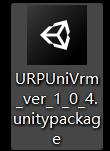
首先删除角色身上的所有脚本
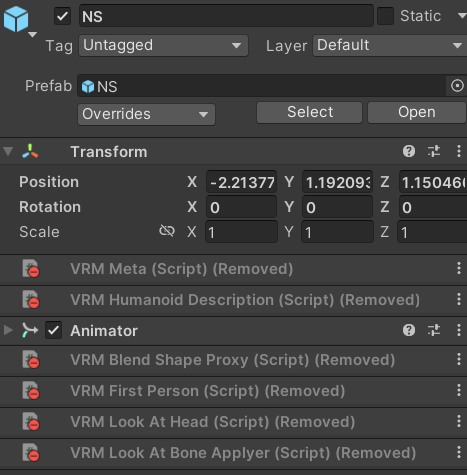
新拖入的角色有紫色的球
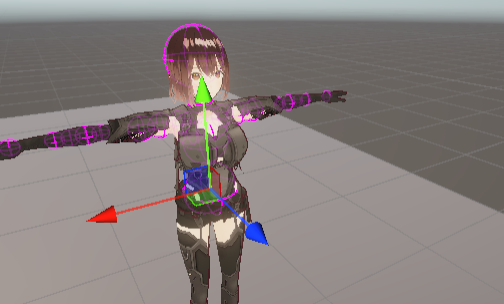
删除所有的物体上的VRMSPringBoneColliderGroup脚本
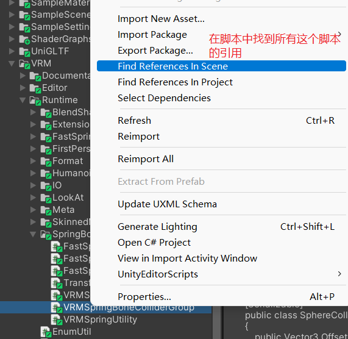
secondary是头发相关的控制，我们将它整个删掉。
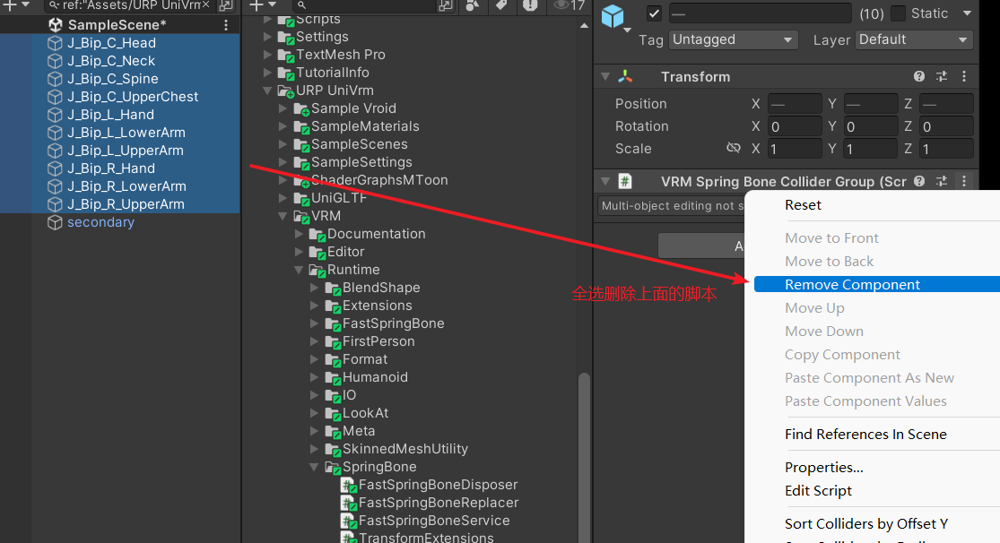

这里准备的动作资源是这个有点老。需要手动到Unity中跟换一下api，有备注，按备注改即可。资源商城中已经找不到了。
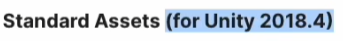
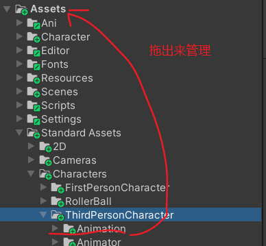

### Character（角色）
有限状态机

制作Controller

#### 站立姿态混合树
（有多方向不同速度的运动就使用2dFreeFormDirectional）所以这里我们选Cartesian。
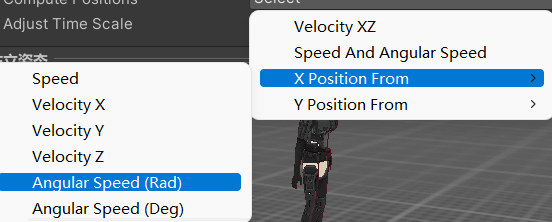
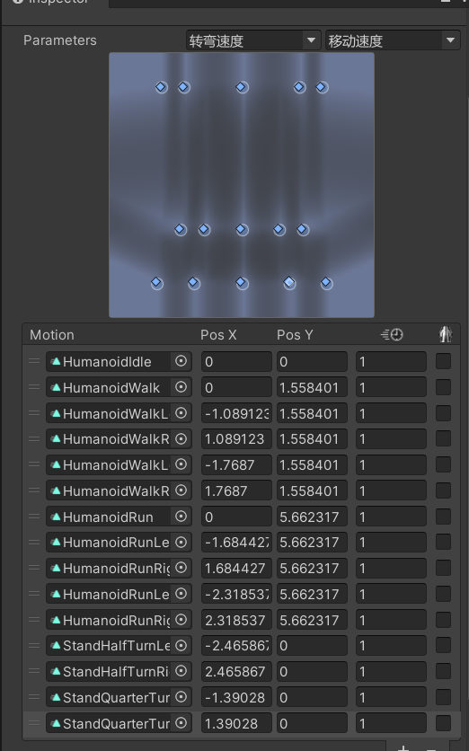

#### 下蹲状态混合树
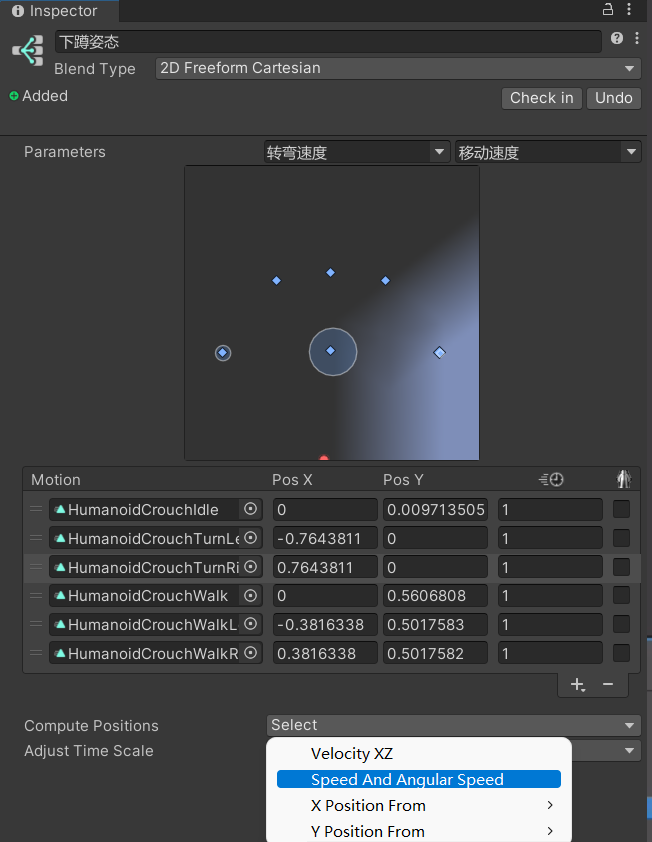

PackageManager中找到InputSystem
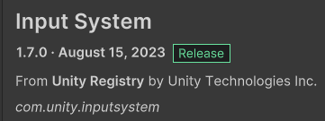

新建角色控制脚本    ThirdPersonShooterController.cs

### Camera（摄像机）
在PackageManager中安装Cinemachine
Hierarchy中右键新建一个FreeLook Camera：一个多相机的管理方案，同时提供了三个高度位置不同的Orbital Transposer相机
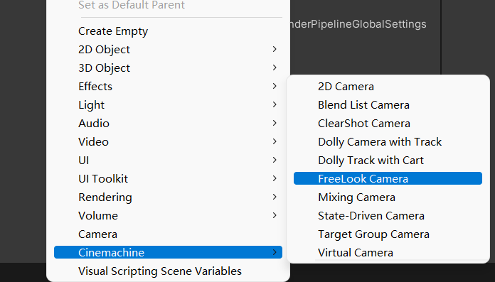
这些参数调整合适
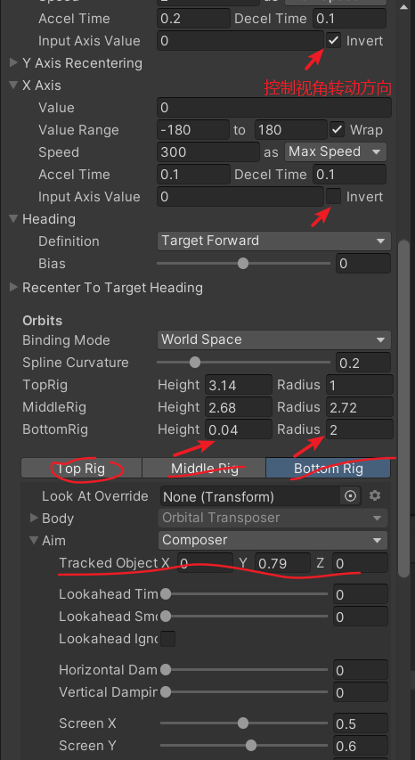
### Control（控制）
newInputSystem
在项目视图里右键新建一个Action
#### 配置Action
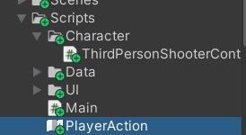
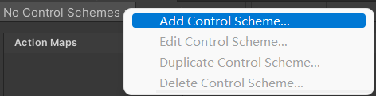
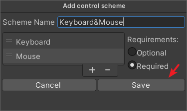
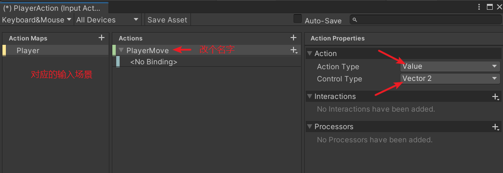
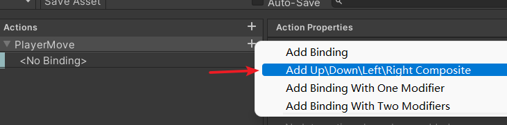
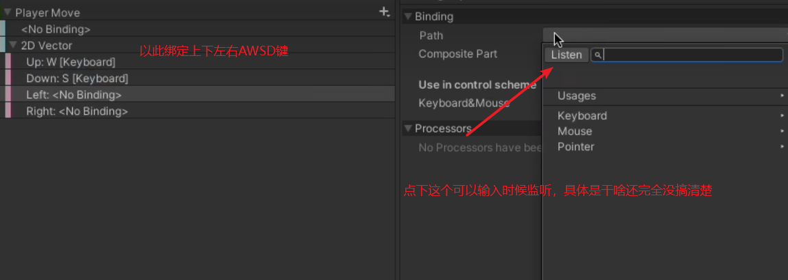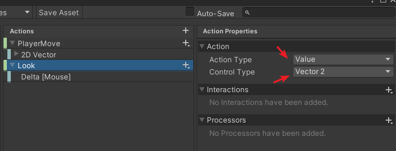
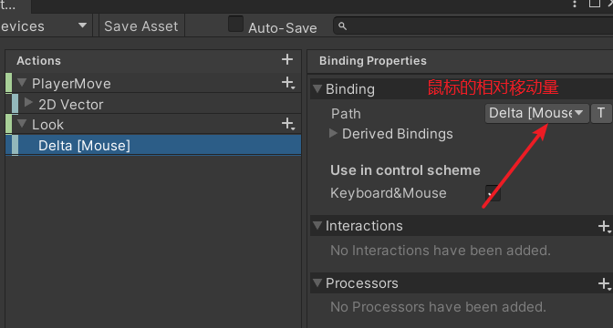
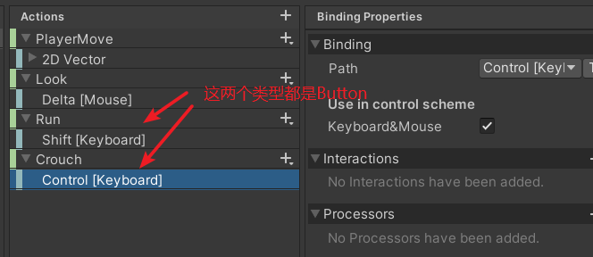
最后一定要SaveAsset

然后到FreeLook Camera相机下的脚本下跟换输入配置
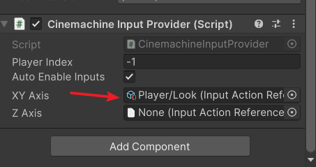