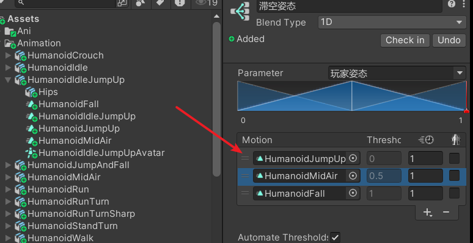
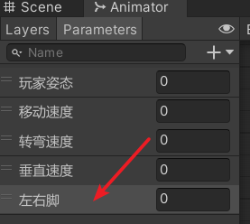
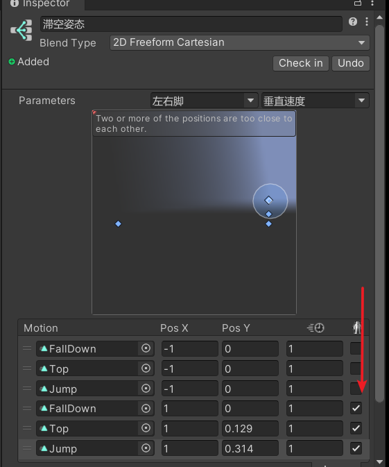
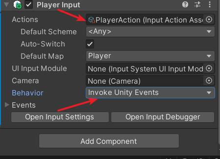
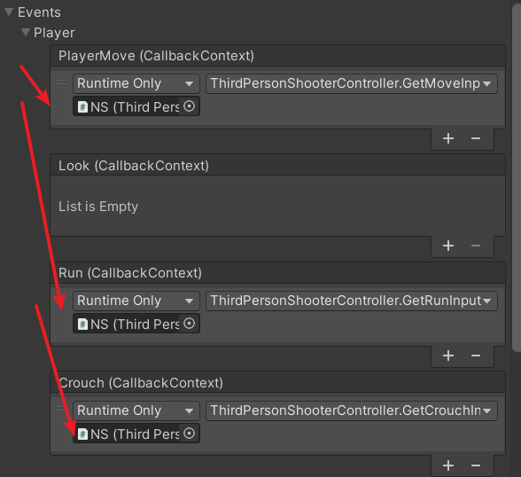
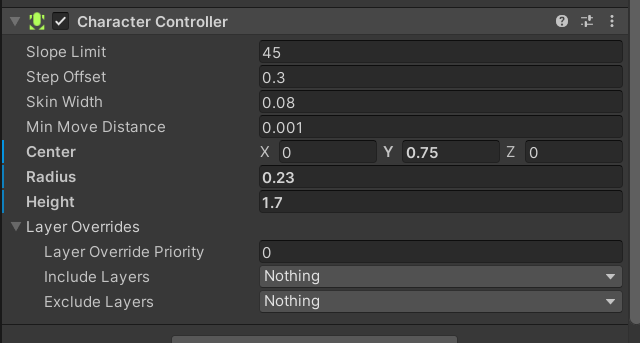

在 Unity 中，TPS 通常是指第三人称射击（Third - Person Shooter）游戏类型。
3C 通常指的是 Character（角色）、Camera（摄像机）、Control（控制）
### 角色准备
在GitHub中找到这个包，导入Unity中就可以将vroid中的角色拖进去了。

首先删除角色身上的所有脚本

新拖入的角色有紫色的球

删除所有的物体上的VRMSPringBoneColliderGroup脚本

secondary是头发相关的控制，我们将它整个删掉。


这里准备的动作资源是这个有点老。需要手动到Unity中跟换一下api，有备注，按备注改即可。资源商城中已经找不到了。


### Character（角色）
有限状态机

制作Controller

#### 站立姿态混合树
（有多方向不同速度的运动就使用2dFreeFormDirectional）所以这里我们选Cartesian。


#### 下蹲状态混合树


PackageManager中找到InputSystem


新建角色控制脚本    
#### ThirdPersonShooterController.cs
```C#
using System;  
using System.Collections;  
using System.Collections.Generic;  
using UnityEngine;  
using UnityEngine.InputSystem;  
  
public class ThirdPersonShooterController : MonoBehaviour  
{  
    Transform playerTransform;  
    Animator animator;  
    Transform cameraTransform;  
    CharacterController characterController;      
      
public enum PlayerPosture  
    {  
        Crouch,  
        Stand,  
        Midair  
    };  
    public PlayerPosture playerPosture = PlayerPosture.Stand;  
  
    float crouchThreshold = 0f;  
    float standThreshold = 1f;  
    float midairThreshold = 2f;  
  
    public enum LocomotionState  
    {  
        Idle,  
        Walk,  
        Run  
    };  
    public LocomotionState locomotionState = LocomotionState.Idle;  
  
    public enum ArmState  
    {  
        Normal,  
        Aim  
    };  
    public ArmState armState = ArmState.Normal;  
  
    float crouchSpeed = 1.5f;  
    float walkSpeed = 2.5f;  
    float runSpeed = 5.5f;  
  
    Vector2 moveInput;  
    bool isRunning;  
    bool isCrouch;  
    bool isAiming;  
    bool isJumping;  
    int postureHash;  
    int moveSpeedHash;  
    int turnSpeedHash;  
  
    // 玩家实际要移动的方向  
    Vector3 playerMovement = Vector3.zero;  
    // Start is called before the first frame update  
    void Start()  
    {        playerTransform = transform;  
        animator = GetComponent<Animator>();  
        cameraTransform = Camera.main.transform;  
        characterController = GetComponent<CharacterController>();  
        postureHash = Animator.StringToHash("玩家姿态");  
        moveSpeedHash = Animator.StringToHash("移动速度");  
        turnSpeedHash = Animator.StringToHash("转弯速度");  
        Cursor.lockState = CursorLockMode.Locked;  
    }  
// Update is called once per frame  
    void Update()  
    {        SwitchPlayerStates();  
        CaculateInputDirection();  
        SetupAnimator();  
    }    #region 输入相关  
    public void GetMoveInput(InputAction.CallbackContext ctx)  
    {        moveInput = ctx.ReadValue<Vector2>();  
    }  
    public void GetRunInput(InputAction.CallbackContext ctx)  
    {        isRunning = ctx.ReadValueAsButton();  
    }  
    public void GetCrouchInput(InputAction.CallbackContext ctx)  
    {        isCrouch = ctx.ReadValueAsButton();  
    }  
    public void GetAimInput(InputAction.CallbackContext ctx)  
    {        isAiming = ctx.ReadValueAsButton();  
    }    #endregion  
    void SwitchPlayerStates()  
    {        if (isCrouch)  
        {            playerPosture = PlayerPosture.Crouch;  
        }        else  
        {  
            playerPosture = PlayerPosture.Stand;  
        }  
        if (moveInput.magnitude == 0)  
        {            locomotionState = LocomotionState.Idle;  
        }        else if (!isRunning)  
        {            locomotionState = LocomotionState.Walk;  
        }        else  
        {  
            locomotionState = LocomotionState.Run;  
        }  
        if (isAiming)  
        {            armState = ArmState.Aim;  
        }        else  
        {  
            armState = ArmState.Normal;  
        }    }    // 将世界坐标系下的方向，转换成相机坐标系下的方向  
    void CaculateInputDirection()  
    {        Vector3 camForwardProjection = new Vector3(cameraTransform.forward.x, 0, cameraTransform.forward.z).normalized;  
        playerMovement = camForwardProjection * moveInput.y + cameraTransform.right * moveInput.x;  
        playerMovement = playerTransform.InverseTransformVector(playerMovement);  
    }  
    void SetupAnimator()  
    {        if (playerPosture == PlayerPosture.Stand)  
        {            animator.SetFloat(postureHash, standThreshold, 0.1f, Time.deltaTime);  
            switch (locomotionState)  
            {                case LocomotionState.Idle:  
                    animator.SetFloat(moveSpeedHash, 0, 0.1f, Time.deltaTime);  
                    break;  
                case LocomotionState.Walk:  
                    animator.SetFloat(moveSpeedHash, playerMovement.magnitude * walkSpeed, 0.1f, Time.deltaTime);  
                    break;  
                case LocomotionState.Run:  
                    animator.SetFloat(moveSpeedHash, playerMovement.magnitude * runSpeed, 0.1f, Time.deltaTime);  
                    break;  
            }        }        else if (playerPosture == PlayerPosture.Crouch)  
        {            animator.SetFloat(postureHash, crouchThreshold, 0.1f, Time.deltaTime);  
            switch (locomotionState)  
            {                case LocomotionState.Idle:  
                    animator.SetFloat(moveSpeedHash, 0, 0.1f, Time.deltaTime);  
                    break;  
                default:  
                    animator.SetFloat(moveSpeedHash, playerMovement.magnitude * crouchSpeed, 0.1f, Time.deltaTime);  
                    break;  
            }        }  
        if (armState == ArmState.Normal)  
        {            // 当前移动方向和玩家transform正前方Forward之间的夹角，用弧度表示，和root motion的转向速度单位一致  
            float rad = Mathf.Atan2(playerMovement.x, playerMovement.z);  
            animator.SetFloat(turnSpeedHash,rad,0.1f, Time.deltaTime);  
            // 转速太慢，人为添加一个旋转  
            playerTransform.Rotate(0, rad *200 *Time.deltaTime, 0f);  
        }    }  
    //  Animator 组件进行动画更新时，这个方法会被调用。  
    //  OnAnimatorMove方法为开发者提供了一个在动画更新过程中进行自定义操作的机会，使动画与游戏逻辑更加紧密地结合在一起  
    private void OnAnimatorMove()  
    {        characterController.Move(animator.deltaPosition);  
    }}
```
这里是人物站立，行走，下蹲的做好时候的方法。
下面我们还需要去做人物的跳跃

#### 人物的跳跃


(待完善)

给玩家添加跳跃的随机脚





### Camera（摄像机）
在PackageManager中安装Cinemachine
Hierarchy中右键新建一个FreeLook Camera：一个多相机的管理方案，同时提供了三个高度位置不同的Orbital Transposer相机

这些参数调整合适

### Control（控制）
newInputSystem
在项目视图里右键新建一个Action
#### 配置Action


最后一定要SaveAsset

然后到FreeLook Camera相机下的脚本下跟换输入配置


#### 给角色添加PlayerInput

在输入事件中放入我们写好的输入方法。


给角色添加