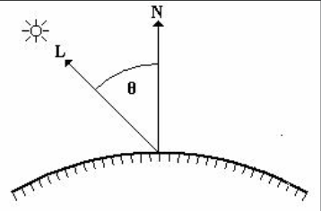
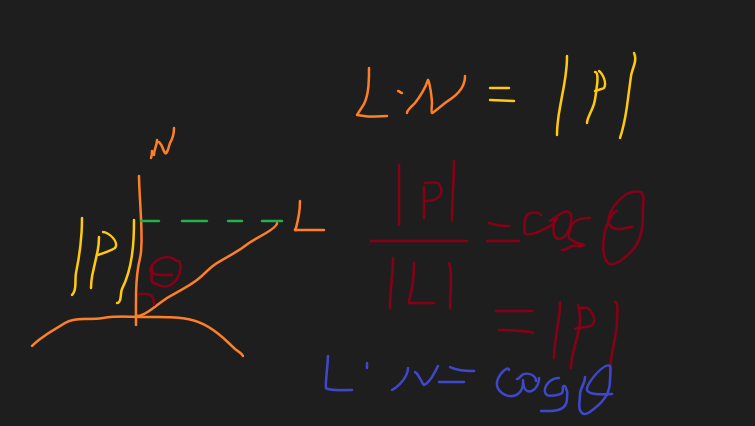

## 两个颜色相乘
两个颜色变量相乘，得到的结果表示两个颜色叠加在一起。
## 模型原理

漫反射光照符合兰伯特定律（Lambert’s law）：反射光线的强度与表面法线和光源方向之间夹角的余弦值成正比，夹角越大，受到的光线照射量越少，当夹角大于90度，光线照射物体背面，此时认为光照强度为0。
## 公式
假设：入射光线的光强度为L，入射光线和某顶点法线夹角为&
反射光线强度为L\*Cos&

> [!NOTE] 公式
>  漫反射光照颜色 = 光源的颜色 \* 材质的漫反射颜色 * max(0,标准化后的物体表面法线向量\*标准化后光源向量)

标准化后的物体表面法线向量\*标准化后光源向量得到的结果就是cos&
max(0,cos&）目的是避免负数，对于模型背面的部分，认为找不到光,即为黑色

## 如何在Shader中获取公式中的关键信息
1.光源颜色
2.光源方向
3.向量归一化方法
4.取最大值方法
5.点乘方法
6.兰伯特光照模型环境光变量
7.将法线从模型空间转换到世界空间