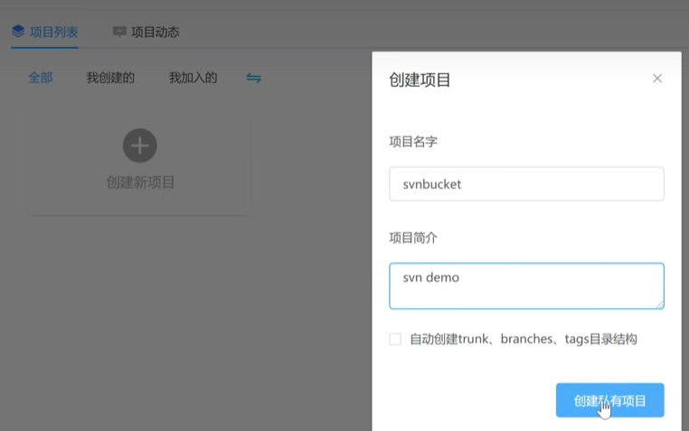

### 基础操作
教程看[svn使用教程 · SVN使用教程](https://svnbucket.com/posts/svn-tutorial/)就够了。这个官网做的确实可以，中文清晰易懂，gif动图的一步步演示，提供的都是易实现的操作，门槛非常低。

与git相比优势：
- 有目录级权限控制，企业安全必备，能够按目录划分权限
- 子目录Checkout，减少不必要的文件检出，git必须将整个仓库拉下来

SVN仓库：服务段
	推荐：svnbucket.com，SVN桶

SVN客户端
	Window:TortoiseSVN
	Mac:Cornstone

服务端网站：https://svnbucket.com/
注册一个装好就可以新建一个项目

复制这个地址到一个文件夹下去检出checkout即可。

具体操作：.svn文件里面可以右键进行一系列操作
注意：如果新增了一个文件，这个文件右键是没有任何反应的，必须commit之后这个文件才会纳入到这个仓库里面才会进行之后的操作。

右键SVN Update更新代码，可以同步现在仓库里面的代码，Commit之前先提交一遍代码，可以避免覆盖别人的代码和发生冲突。

TortoiseSVN->Revert 就可以丢弃本地修改

## 进阶
#### 撤销已经提交的代码。

如果是用git这个就比较麻烦。

如果本地还没有推送远程仓库，就git reset回退
如果本地已经推送到远程仓库，就先git reset回退再强制覆盖远程提交记录。

但是svn就只有一个仓库。所以
1. 右键TortoiseSVN ==> show log 查看提交记录
2. 选择我们需要回去的版本，右键选择`Revert to this version`，这样就回去了指定的版本
3. 最后你还需要`commit`下撤销后的代码到SVN仓库

####  SVN仓库的目录
每个仓库的根目录都创建trunk,branckes,tags目录：
- 开发时候再trunk写代码，线上产品就创建分支到branches目录，线上产品出问题了，就再对应的分支上进行修复，最后把修复后的代码合并到trunk主干上。

创建分支：从trunk（就是一套项目的代码）可以创建出（复制出）一个分支到branches目录下一个version1.0/2.0/3.0中。

合并分支：设我们在分支上修复了一个线上的BUG，需要把代码那个代码合并到主干来，操作步骤：
1. 在分支的跟目录点击`show log`
2. 选中需要合并过去主干的提交记录（可以多选）
3. 点击`merge revision to ...`
4. 选择主干的跟目录，点击确定，就合并过去了。
5. 在主干上提交这次合并的内容

注：
汉化包安装完不显示是因为版本不一样，如果安装错了版本需要到c盘下的programfiles/tortoisesvn删掉languages然后重新安装