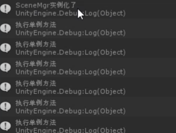
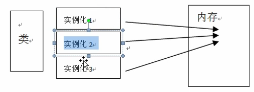

普通类的实例存储在托管堆中，静态类的静态成员存储在方法区，单例模式中的静态成员也存储在方法区
托管堆是由公共语言运行时（CLR）管理的内存区域，用于存储对象实例。
方法区是存储类的元数据、静态变量、静态方法等信息的内存区域。
单例模式中的静态成员主要用于确保类的实例唯一性，而普通静态成员则用于存储类级别的信息和方法。
##### 普通类中的单例
```C#
public class SceneMgr
{
	// 静态变量属于类上，不属于类实例
	private static SceneMgr _Instance;
	public static SceneMgr Instance
	{
		get
		{
			if(_Instance == null)
			{
				_Instance = new SceneMgr();
				Debug.Log("SceneMgr实例化了")
			}
			return _Instance
		}
	}
	public void testLog()
	{
		print("单例方法")
	}

}
```
在别的类中使用
```C#
void Update()
{
	for(int i = 0;i <10;i++)
	{
		SceneMgr.Instance.TestLog();
	}	
}

```
可以看出单例模式被实例化1次

##### 继承自MonoBehavier的单例
运行游戏会直接创建一个空物体
```C#
public class BoxCtrl : MonoBehavier
{
	private static BoxCtrl _Instance
	public static BoxCtrl Instance
	{
		get
		{
			if(_Instance == null)
			{
				GameObject obj = new GameObject("BoxCtrl");
				_Instance = obj.AddComponent<BoxCtrl>();
				DontDestoryOnLoad(obj);
			}
			return _Instance;
		}
	}
	public void testLog()
	{
		print("单例方法")
	}
}
```
如果一个脚本在场景中只在唯一一个物体上面有,下面这样写即可
```C#
 public class TestScene : MonoBehavier
{
	public static TestScene Instance;
	void Awake()
	{
		Instance = this;
	}
}
```

##### 高并发下的单例
