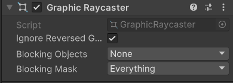

图形射线投射器组件
UGUI的元素能被我们点击不是使用碰撞器，而是通过图形的大小检测射线的交互
现在我新建一个Image发现下面并没有

Ignore Reversed Graphics:是否忽略反转图形
转z轴就相当于在平面上旋转，转y和x会被忽略。

这两个在覆盖渲染模式下无效，因为覆盖模式没有碰撞器在UI元素的前面。
Blocking Object：射线被哪些类型的碰撞器阻挡
决定射线检测时候是否检测2d或者3d碰撞器
Blocking Mask: 射线被哪些层级的碰撞器阻挡
