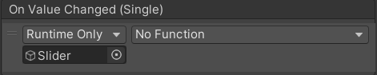
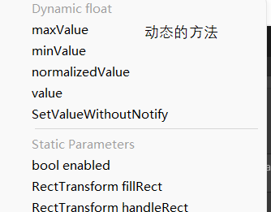

### 是什么

默认由四组对象组成
父对象——Slider组件依附的对象
子对象——背景图，进度图(包括可以的填充区域和实际填充)，滑动块


### Slider参数控制

```C#
Slider s = this.GetComponent<Slider>();
print(s.value);
```

### 监听事件的两种方式
1.托脚本

```C#
public void ChangeValue(float v)
{
	print(v);
}
```
注意这里要拖动态的方法进去才能实时打印出来


2.代码添加
```C#
Slider s = this.GetComponent<Slider>();
print(s.value);

// 这里面传的一个事件
s.onValueChange.AddListener((v) =>{
	print("代码添加的监听" + v )
})
```

### 制作血条
```C#
using System.Collections;
using System.Collections.Generic;
using UnityEngine;
using UnityEngine.UI;  //Slider的调用需要引用UI源文件

public class HPCtroller : MonoBehaviour
{
	// 这里是通过直接拖Slider进去挂载
    public Slider HP;  //实例化一个Slider

    private void Start()
    {
        HP.value = 1;  //Value的值介于0-1之间，且为浮点数
    }

    void Update()
    {
        if(Input.GetKeyDown(KeyCode.A))  //如果按下A键，血量就会减少
        {
            HP.value = HP.value - 0.1f;  
        }
        else if(Input.GetKeyDown(KeyCode.D))  //按下D键，血量就会增加
        {
            HP.value = HP.value + 0.1f;
        }
    }
}
```