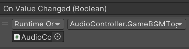

### 是什么
UGUI中处理玩家单选框多选框相关交互的关键组件

开关组件，默认是多选框，配合ToggleGroup制作单选框

默认创建由4个对象组成
父对象——Toggle组件依附
子对象——背景图，选中图，说明文字（可选）

### 参数：
isOn:当前是否处于打开状态
ToggleTransition：在开关值变化时的过渡方式
	None:无过渡效果
	Fade：淡入淡出
Graphic：表示用于选中状态的图片，但默认不会改，该下面的子对象图片即可
Group：单选框分组：注意：单选框分组组件可以挂载在任何对象上，只需要个一组单选框关联即可
	配合一个组件拖进来使用
### 代码控制
```C#
Toggle tog = this.GetComponent<Toggle>();
tog.isOn = true;

ToggleGroup togGroup = this.GetComponent<ToggleGroup>();
togGroup.allowSwitchOff = true;

//得到激活状态下的Toggle
foreach(Toggle item in togGroup.ActiveToggles())
{
	print(item.name + " " + item.isOn);
	
}
```

### 监听事件的两种方式
1.拖脚本
```
public void ChangeValue(bool isOn)
{
	print("状态改变" + isOn);
}
```
代码添加
```
tog.onValueChange.AddListener(ChangeValue2);

tog.onValueChange.AddListener((v) =>{
	print("代码添加的监听" + v )
})

private

```
会把当前监听到的值传进来就是v


### 使用PlayerPrefs制作一个音量控制器

GameBGMToggleButton()和BGMToggleButton()需要绑定到下面，这个都是静态方法。

```C#
using System.Collections;
using System.Collections.Generic;
using UnityEngine;
using UnityEngine.UI;

public class AudioController : MonoBehaviour
{
    public Toggle SetBGMToggle;
    public Toggle GameBGMToggle;
    public Image background; 
    public Slider BGMSlider;

    [SerializeField]
    [Header("背景音乐")]
    AudioSource BgmAudio;

    [SerializeField]
    [Header("音效")]
    AudioSource SfxAudio;

    public AudioClip bgm;
    public AudioClip click;
    public AudioClip attack;
    public AudioClip autoAttack;

    private static AudioController _instance;

    public static AudioController Instance
    {
        get
        {
            if (_instance == null)
            {
                _instance = FindObjectOfType<AudioController>();
                if (_instance == null)
                {
                    GameObject audioControllerObject = new GameObject("AudioController");
                    _instance = audioControllerObject.AddComponent<AudioController>();
                }
            }
            return _instance;
        }
    }

    private void Awake()
    {
        if (_instance != null && _instance != this)
        {
            Destroy(gameObject);
        }
        else
        {
            _instance = this;
            DontDestroyOnLoad(gameObject);
        }
    }

    private void Start()
    {
        // 初始化背景音乐
        BgmAudio.clip = bgm;
        BgmAudio.Play();

        BGMManager();
        BGMValueManager();
        GameBGMManager();
    }

    private void Update()
    {
    }

    public void PlaySfx(AudioClip clip)
    {
        SfxAudio.PlayOneShot(clip);
    }

    // 玩家UI中开关音乐触发该方法
    public void BGMToggleButton()
    {

        if (SetBGMToggle.isOn)
        {
            // Open BGM and Sfx
            PlayerPrefs.SetInt("BGM", 1);// 1 means open
            Debug.Log(PlayerPrefs.GetInt("BGM"));
        }
        else
        {
            // Close BGM and Sfx
            PlayerPrefs.SetInt("BGM", 0);// 0 means close
            Debug.Log(PlayerPrefs.GetInt("BGM"));
        }
        GameBGMManager();
        BGMManager();
    }
    // 玩家UI中开关音乐触发该方法
    public void GameBGMToggleButton()
    {

        if (GameBGMToggle.isOn)
        {
            // Open BGM and Sfx
            PlayerPrefs.SetInt("BGM", 1);// 1 means open
            Debug.Log(PlayerPrefs.GetInt("BGM"));
        }
        else
        {
            // Close BGM and Sfx
            PlayerPrefs.SetInt("BGM", 0);// 0 means close
            Debug.Log(PlayerPrefs.GetInt("BGM"));
        }
        // 设置
        GameBGMManager();
        BGMManager();
    }


    // 玩家拖动音乐条触发该方法
    public void BGMSliderButton(float v)
    {
        // Open BGM and Sfx
        PlayerPrefs.SetFloat("BGMValue", v);// 1 means open
        Debug.Log(PlayerPrefs.GetFloat("BGMValue"));
        BGMValueManager();
    }

    // 控制音量大小
    private void BGMValueManager()
    {
        float v = PlayerPrefs.GetFloat("BGMValue",1);

        BGMSlider.value = v;
        BgmAudio.volume = v;
        SfxAudio.volume = v;
    }


    // 读取本地数据设置状态
    private void BGMManager()
    {
        if (PlayerPrefs.GetInt("BGM") == 1)
        {
            SetBGMToggle.isOn = true;

            SfxAudio.enabled = true;
        }

        else if (PlayerPrefs.GetInt("BGM") == 0)
        {
            SetBGMToggle.isOn = false;

            SfxAudio.enabled = false;

        }

    }
    // 读取本地数据设置状态
    private void GameBGMManager()
    {
        if (PlayerPrefs.GetInt("BGM") == 1)
        {
            GameBGMToggle.isOn = true;
            // 设置背景透明
            background.color = new Color(background.color.r, background.color.g, background.color.b, 0f);
            SfxAudio.enabled = true;
        }

        else if (PlayerPrefs.GetInt("BGM") == 0)
        {
            GameBGMToggle.isOn = false;
            // 设置背景显示
            background.color = new Color(background.color.r, background.color.g, background.color.b, 1f);
            SfxAudio.enabled = false;
        }
    }
}

```