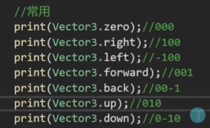

### Vector3基础
用来表示三维坐标系中的一个点或一个向量
Vector3是一个结构体
```C#
Vector3 v = new Vector3();
v.x = 10;
// 只传xy，默认z是0
Vector3 v3 = new Vector(10,10,10);
```
基本运算
```C#
Vector3 v1 = new Vector3(1,1,1);
Vector2 v12 = new Vector3(2,2,2);
// 对应x加和减
print(v1 + v12);
print(v1 - v12);
```

```C#
// 计算两点之间的距离
print(Vector3.Distance(v1,v12));
```
#### 位置
相对世界坐标系的原点的位置（不会因为挂载而改变）
和面板上显示的是不一样的。
```C#
// this.gameObject.transform
print(this.transform.position);
```
相对父对象
```C#
print(this.transform.localPosition);
```

父对象的坐标就是世界坐标系原点0，0，0
注意：位置的赋值不能直接单独改变x，y，z只能整体改变，
```

```
#### 扩展：RectTransform.anchoredPosition
是相对于父对象的锚点计算出来的值
	`anchoredPosition` 表示子 `RectTransform` 的锚点相对于父 `RectTransform` 的锚点的位置。这个属性的值是局部坐标，即相对于父对象的坐标系。
与 `RectTransform` 面板的关系
     `RectTransform` 面板上显示的 `Position` 值是 `anchoredPosition` 的值，但它是以更直观的方式显示的，通常包括 `X`、`Y` 和 `Z` 坐标。

对象当前的各个朝向

注意：位置的赋值不能直接改变x，y，z只能整体改变
```C#
this.transform.position = new Vector3(10,10,10);
this.transform.localPosition = Vector3.up * 10;
```
#### 位移
