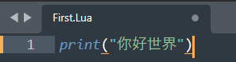

## 开发环境
Lua for Windows v5.1.5-52 Released
sublime text
实际项目中会用VSCode，IDEA等IDE
## 创建lua脚本

运行
Ctrl + B
```C#
--单行注释
--lua语句可以省略分号
print("你好世界")

--[[
多行注释
]]

--[[
第二种多行注释
]]--

--[[
第三种多行注释，我选第一种
--]]
```
## 8种变量类型
lua中所有的变量申明都不需要申明变量类型，他会自动判断类型,随便赋
类似Python和C#里面的 var
```Lua
print('********变量**********')
--lua中的简单变量类型
-- nil number string boolean 四种类型

-- lua中使用没有申明过的变量，默认值是nil
print(b)

a = nil
print(a)
a = 1
print(a)
-- lua里没有char，只有string
a = "132233"
a = true
-- 通过type函数 返回值是string 可以得到变量的类型
print(type(a))
```

lua中的简单变量类型
-- nil number string boolean 四种类型

复杂的4种变量类型（后续）
-- function table userdata thread 函数 表 数据结构 协同程序


