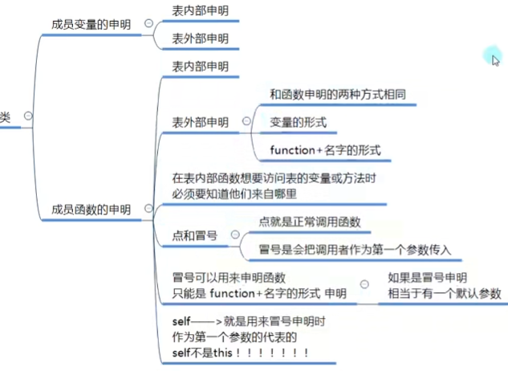

## 类和结构体
lua中默认没有对象，需要我们自己实现
```lua
Student = {
	--年龄
	age = 1,
	--性别
	sex = true,
	--函数
	Up = function()
		--print(age),这个age和表中的age没有任何关系，是一个全局变量,要想在表内部函数中使用表本身属性或方法，有如下方法
		print(Student.age)--第一种
		print("我成长了")
	end
	Learn = function(t)
		print(t.sex)--第2种
		print("好好学习，天天向上")
	end
}
Student.Learn(Student)--第二种
Student:Learn()
-- 在外面申明
Student.name = "我的"
Student.Speak = function()
	print("说话")
end
function Student.Speak2()
	print("2说话")
end
-- Lua中类的表现，类似C#中静态变量和函数
print(Student.age)
Student.Up()
Student.Speak()
Student.Speak2()
```
## 点和冒号的区别
冒号调用方法，会默认将调用者作为第一个参数传入方法中
```lua
Student.Learn(Student)
Student:Learn()
```
冒号申明函数只能是function+名字的形式申明
```lua
--在外部申明函数的时候也能用冒号
function Student.Speak2()
	print("2说话")
end
--默认有一个参数
--lua中有一个关键字self表示默认转入的第一个参数
function Student:Speak2()
	print(self.name.."说话")
end
```
