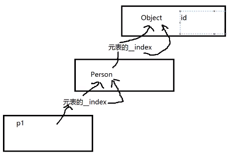

## 封装
- 表就是表现类的一种形式
- 实现了new方法，本质上是创建了一个空表，设置了元表和__index属性
- 修改创建出来的对象的属性变量时，本质就是为这个空表变量新建了一个成员变量
```lua
Object = {}
Obejct.id = 1
function Object:Test()
	print(self.id)
end
--Object中的new方法是会默认传一个参数的哦
function Object:new()
	local obj = {}
	self.__index = self
	setmetatable(obj,self)
	return obj
end
```
## 继承
- 写继承方法
- \_G来根据字符串来创建一个新的表（类）
- 元表和_index相关知识点来达到一个继承的表现
- 
```lua
function Object:subClass(className)
	_G[className] = {}
	--写相关继承的规则
	--用到元表
	local obj = _G[className]
	self.__index = self
	setmetatable(obj,self)
end

Object:subClass("Person")
local p1 = Person:new()
print(p1.id)
```

## 多态
