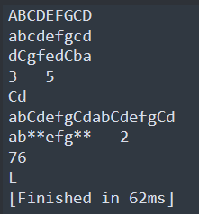

不分单双引号
### 获取字符串的长度
一个中文占3个长度
```lua
s = "abhifudwebhfiu"
print(#s)
```
### 字符串多行打印
```lua
print("123\n123")
s = [[
带坏
小朋友
]]
```
### 字符串拼接
注 Lua 语言在定义数值类型上只有 `number` 这一种涵盖了整数和浮点数的类型，但通过 `%d` 和 `%f` 可以让同一个 `number` 类型以整数或浮点数表现形式展示
```lua
print("123" .. "456")
-- 占位符和C语言类似
-- %d:用于整数格式化输出形式
-- %f:用于浮点数格式化输出形式
-- %a:与任何字符拼接
-- %s:与字符串配对
print(string.format("我是熊大，我今年%d岁",18))
```
### 别的类型转字符串
```lua
a = true
print(tostring(a))
```

### 字符串提供的公共方法
```lua
str = "abCdefgCd"
-- 小写转大写，不会改变原字符串，只会返回一个新的字符串
print(string.upper(str))
-- 大写转小写
print(string.lower(str))
-- 翻转字符串
print(string.reverse(str))
-- 字符串索引查找
print(string.find(str,"Cde"))
-- 截取字符串
print(string.sub(str,3,4))
-- 字符串重复
print(string.rep(str,2))
-- 字符串修改
print(string.gsub(str,"Cd","**"))
-- 字符转ASCII码,将Lua中的L转
a = string.byte("Lua",1)
print(a)
-- ASCII码 转字符
print(string.char(a))
```
运行结果

