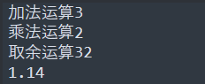

### 算数运算符
\+ - \* / %
没有自增自减 ++ -- 
没有复合运算符 += -= /= \*= \%=
字符串可以进行算数运算符操作吗，会自动换成number
```lua
print("加法运算" .. 1 + 2)
print("乘法运算" .. 1 * 2)
print("取余运算" .. 2 ^ 5)
print("123.14" % 2)
```

### 条件运算符
\> < >= <= == 
~=不等于
### 逻辑运算符
与 ： and
或 ：or
非 ： not
lua中也遵循逻辑运算的”短路“规则
```lua
print(true or flase)
print(not true)
```
### 位运算符
lua中不支持位运算符 & |
需要我们自己实现
### 三目运算符
lua中也不支持 ？ ：