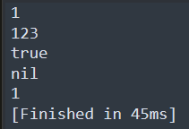

### 基本语法
function 函数名()
end

a = function()
end
### 无参数无返回值
```Lua
function F1()
	print("F1函数")
end
--函数声明后才能使用
F1()
```
有点类似C#中的委托和事件，函数也是一种类型
```lua
F2 = function()
	print("F2函数")
end
F2()
```

### 有参数

```lua
function F3(a)
	print(a)
end
F3(1)
F3("123")
F3(true)-- true不支持拼接操作。
-- 如果传入的参数和函数参数个数不匹配，不会报错只会补空或丢弃
F3()
F3(1,2,3)
```

### 有返回值
```lua
function F4(a)
	return a,"123",true
end
-- 多返回值时，在前面申明多个变量来接取即可
-- 如果变量不够，不影响值接取对应位置的返回值
-- 如果变量多，会直接赋nil
temp, temp2,temp3 = F4("1")
```
### 函数的类型
```lua
F5 = function()
	print("123")
end
print(type(F5))
```
返回一个function
### 函数的重载
函数名相同,参数类型不同,或者参数个数不同
lua中不支持重载，默认调用最后一个声明的函数
```lua
function F6()
	print("不支持啊")
end
function F6(str)
	print(str)
end
F6()
```
### 变长参数
变长参数（Variadic Arguments）是一种允许函数接收不定数量参数的机制
```lua
function F7(...)
	-- 变长参数使用，先用一个表存起来
	arg = {...}
	for i = 1,#arg do
		print(arg[i])
	end
end
F7(1,"123",true,4,5,6)
```
### 函数嵌套
```lua
function F8()
	F9 = function()
		print(123)
	end
	return F9
end

f9 = F8()
f9()
```
高级点写法
```lua
function F8()
	return function() -- 这里不能取名字
		print(123);
	end
end
```

### lua中闭包的体现
```lua
-- 临时变量x的生命周期改变到返回的函数里面去了
function F9(x)
	-- 若在这申明的参数进里面的函数也会闭包	
	-- 改变了传入参数的生命周期
	return function(y) -- 这里不能取名字
		return x + y
	end
end
f10 = F9(10)
print(f10(5))
```
打印出15