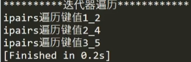
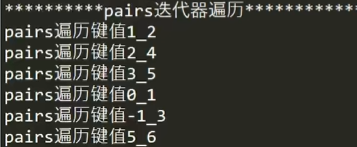

## 主要是用来遍历表的
\#得到长度是不准确的，一般不用#来遍历表
## ipairs
只能找到连续索引的键，如果中间断序了，无法遍历后面内容，我会用?
```lua
a = {[0] = 1,2,[-1] = 3,4,5,[5] = 6}

for i,k in ipairs(a) do
	print("ipairs遍历键值"..i.."_"..k)
end
```

## pairs
能把所有的键都找到，建议使用
```lua
a = {[0] = 1,2,[-1] = 3,4,5,[5] = 6}

for i,k in pairs(a) do
	print("pairs遍历键值"..i.."_"..k)
end
--[[
for i in pairs(a) do
	print("pairs遍历键值"..i)
end 这种直接遍历键
]]--
```

## ipairs和pairs的 区别
ipairs不能找到0或者0以下的自定义索引内容，从1开始索引顺序后面断了也找不到之后内容，key是非数字也遍历不出来
pairs可得所有，遍历各种不规则表，但是根据table中的key的hash值来排列的顺序来遍历的，每次的结果可能不同

## 求table长度
\#求长度时候断了后面就出不来了。
```lua
```