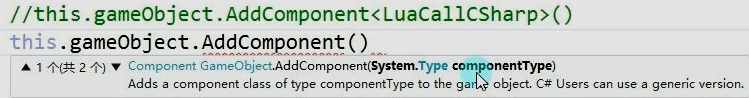

Main.lua
```lua
print("主Lua脚本")
require("CallClass")
```

新建Main.cs
Lua没有办法直接访问C#，一定是先从C#调用Lua脚本后，在由Lua写核心逻辑
```c#
public class Main : MonoBehavior
{
	void Start()
	{
		LuaMgr.GetInstance().Init();
		LuaMgr.GetInstance().DoLuaFile("Main");
	}
}
```

新建LuaCallCSharp.cs
```C#
// 自定义类
public class Test
{
	public void Speak(string str)
	{
		Debug.Log("Test1" + str);
	}
}

namespace Mss
{
	public class Test2
	{
		public void Speak(string str)
		{
			Debug.Log("Test2:" + str);
		}
	}
}
```

CallClass.lua
```lua
--CS.命名空间.类名

--通过C#中的类实例化一个对象，lua中没有new，所以直接类名括号就是实例化对象
--默认调用的相当于无参构造
local obj1 = CS.UnityEngine.GameObject();
local obj2 = CS.UnityEngine.GameObject("你不好");

-- 为方便使用，定义全局变量存储C#中的类
GameObject = CS.UnityEngine.GameObject
local obj3 = GameObject("你好呀");

-- 类中的静态对象可以直接使用.来调用
local obj4 = GameObject.Find("老师")

-- 得到对象中的成员变量直接.获得
print(obj4.tranform.position)


Debug = CS.UnityEngine.Debug
Vector3 = CS.UnityEngine.Vector3

-- 如果使用对象中的成员方法！！一定加冒号，用.直接报错
obj4.transform:Translate(Vector3.right)
Debug.Log(obj4.transform.position)

local t = CS.Test()
t:Speak("test说话")

local t2 = CS.Mss.Test2()
t2:Speak("test2说话")

-- 继承了Mono的类 是不能直接new的
-- lua中不支持无参数泛型,所以我们要使用另一个重载

-- xlua提供一个重要方法 typeof 可以得到类的Type
obj5:AddComponent(typeof(CS.LuaCallCSharp))
```


- 实例化对象 ：CS.命名空间.类名（）
- 静态方法和变量：CS.命名空间.类名.方法或者变量
- 成员变量 ： 实例化的对象.变量名
- 成员方法 ： 实例化的对象.方法名
- 可以取别名，节约性能，Debug = CS.UnityEngine.Debug
- lua中不支持无参数泛型,所以我们要使用另一个重载，xlua提供一个重要方法 typeof 可以得到类的Type
- 一定是通过C#进入的Lua