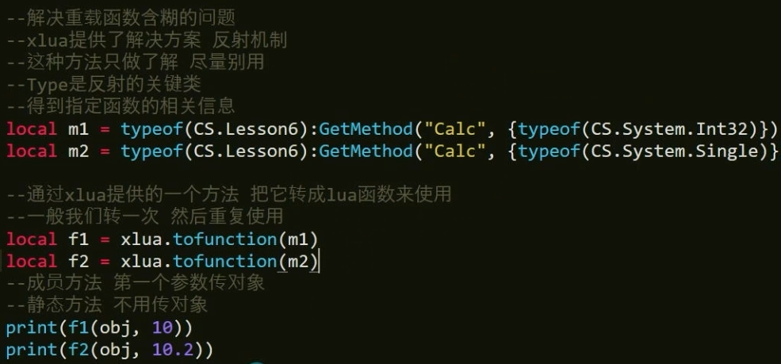

Main.lua
```lua
print("主Lua脚本")
require("CallFunction")
```
LuaCallSharp.cs中
```C#
public class Lesson6
{
	public int Calc()
	{
		return 100;
	}

	public int Calc(int a,int b)
	{
		return a + b;
	}

	public int Calc(int a)
	{
		return a;
	}	
	
	public float Calc(float a)
	{
		return a;
	}	
}
```

新建lua脚本,CallFunction.lua
```lua
Lesson6 = CS.Lesson6
local obj = Lesson6()

-- Lua支持调用C#中的重载函数。虽然Lua自己不支持写重载函数
print(obj:Calc())
print(obj:Calc(15,1))

-- Lua只有Number类型，对C#多精度的重载函数支持不好
-- 使用时，可能出现意想不到的问题
print(obj:Calc(10))
print(obj:Calc(10.2))
```

### 总结
- 尽量申明c#重载函数时候，不要重载参数个数相同精度不的情况
- XLua提供了解决重载含糊的方法
	- 第一步通过Type得到C#函数
	- 通过xlua.tofunction转为lua函数，然后使用
	- 使用时
		- 如成员方法：第一个参数传对象
		- 如静态方法：不用传对象
