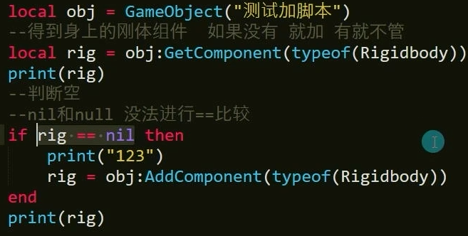

Main.lua
```lua
print("主Lua脚本")

-- 判断的全局函数
-- or前面是真的就不会执行后面的
-- 第二种方法
function IsNull(obj)
	if obj == nil or obj:Equals(nil) then
		return true
	end
	return false
end

require("Special")
```
新建lua脚本Special.lua
正确写法
```lua
GameObject = CS.UnityEngine.GameObject
Rigidbody = CS.UnityEngine.Rigidbody

local obj = GameObject("测试加脚本")
local rig = obj：GetComponent(typeof(Rigidbody))
print(rig)
-- 第一种方法
-- if rig:Equals(nil) then

if IsNull(rig) then
	print("123")
	rig = obj:AddComponent(typeof(Rigidbody))
end
print(rig)
```
错误实例：

需要用到obj：Equal(nil)但是有时候用obj的时候object对象本身就没存在

或者为Object扩展一个方法用于判空，lua没法用null和nil比较
LuaCallCSharp.cs中
```C#
[LuaCallCSharp]
public static class Lesson9
{
	public static bool IsNull(this Object obj)
	{
		return obj == null;
	}
}
public class LuaCallCSharp
{
}
```
第三种写法
```lua
GameObject = CS.UnityEngine.GameObject
Rigidbody = CS.UnityEngine.Rigidbody

local obj = GameObject("测试加脚本")
local rig = obj：GetComponent(typeof(Rigidbody))
print(rig)

if rig:IsNull() then
	print("123")
	rig = obj:AddComponent(typeof(Rigidbody))
end
print(rig)
```
### 总结
- 对象：Equals（nil）。前提是对象是一个Object
- Lua中封装一个全部方法，保险判断
- C#中为Object写一个拓展判空方法
