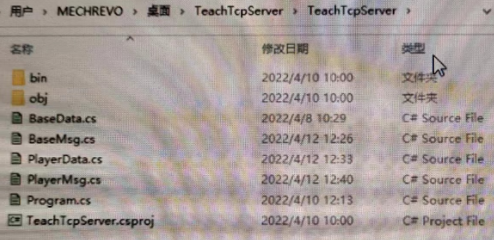

### 发送之前自定义类的二进制消息
1. 继承BaseData类
2. 实现其中的序列化，反序列化，获取字节数等相关方法
3. 发送自定义类数据时序列化
4. 接受自定义类数据时反序列化
### 如何区分消息
解决方案：为发送的消息添加标识，比如添加消息ID
为所有发送的消息的头部加上消息ID（int,short,byte,long都可以）

eg：
如果选用int类型作为消息ID的类型。前4个字节为消息ID，后面字节为数据类的内容
####**
这样每次收到消息，会先把前4个字节取出来解析为消息ID 
再根据ID进行反序列化即可

### 实践操作
1.创建消息基类，基类继承BaseData,基类添加获取消息ID的方法或者属性

创建脚本BaseMsg继承BaseData
```C#
public class BaseMsg : BaseData
{
	public override int GetBytesNum()
	{
		throw new System.NotImplementedException();
	}
	public override int Reading(byte[] bytes,int beginIndex = 0)
	{
		throw new System.NotImplementedException();
	}
	public override byte[] Writing()
	{
		throw new System.NotImplementedException();
	}
	public virtual int GetID()
	{
		return 0;	
	}
}
```

2.让想要被发送的消息继承该基类，实现序列化反序列化方法
新建消息类PlayerMsg
```C#
public class PlayerMsg:BaseMsg
{
	public int playerID;
	public PlayerData playerData;
	public override byte[] Writing()
	{
		int index = 0;
		byte[] bytes = new byte[GetBytesNum()];
		// 先写消息ID
		WriteInt(bytes,GetID(),ref index);
		// 写这个消息的成员变量
		WriteInt(bytes,playerID,ref index);
		WriteData(bytes,playerData,ref index);
		return bytes;
	}
	// 反序列化方法调用之前会先把消息类型ID解析出来，用于判断到底使用哪一个自定义类来反序列化
	public override int Reading(byte[] bytes,int beginIndex = 0)
	{
		int index = beginIndex;
		playerID = ReadInt(bytes,ref index);
		playerData = ReadData<PlayerData>(bytes,ref index);
		return index - beginIndex;
	}
	public override int GetBytesNum()
	{
		return 4 + // 消息ID的长度
			4 + // playerID的字节数组长度
			playerData.GetBytesNum(); // playerData的字节数组长度
	}
	// 自定义的消息ID 区分消息类
	public override int GetID()
	{
		return 1001;
	}
}
```
玩家数据类PlayerData，
```C#
public class PlayerData : BaseData
{
	public string name;
	public int atk;
	public int lev;
	public override int GetBytesNum()
	{
		return 4 + 4 + 4 + Encoding.UTF8.GetBytes(name).Length;
	}
	public override int Reading(byte[] bytes,int beginIndex = 0)
	{
		int index = beginIndex;
		name = ReadString(bytes,ref index);
		atk = ReadInt(bytes,ref index);
		lev = ReadInt(bytes,ref index);
		return index - beginIndex;
	}
	public override byte[] Writing()
	{
		int index = 0;
		byte[] bytes = new byte[GeyBytesNum()];
		WriteString(bytes,name,ref index);
		WriteInt(bytes,atk,ref index);
		WriteInt(bytes,lev,ref index);
		return bytes;
	}
}
```
3.修改客户端和服务端收发消息的逻辑
使用[13.TCP通信_同步_客户端](13.TCP通信_同步_客户端.md)里面的类
```C#
public class Lesson13 : MonoBehaviour
{
	void Start()
	{
	// 1. 创建套接字Socket
		Socket socket = new Socket(AddressFamily.InterNetwork,SocketType.Stream,ProtocolType.Tcp);
	// 2. 用Connect方法与服务端相连
	// 确定服务端的IP和端口
		IPEndPoint ipPoint = new IPEndPoint(IPAddress.Parse("127.0.0.1"),8080); // 这里没有远端所以联本机
		try
		{
			socket.Connect(ipPoint);
		}
		catch(SocketException e) //Socket自带报错类
		{
			if(e.ErrorCode == 10061)
				print("服务器拒绝连接");
			else
				print("连接服务器失败" + e.ErrorCode); // 不同码代表不同错误
			return;
		}
		// 3. 用Send和Receive相关方法收发数据
		// 接受数据
		byte[] receiveBytes = new byte[1024];
		int receiveNum = socket.Receive(receiveBytes);
		//**********************************************
		// 首先解析消息的ID
		// 使用字节数组中的前四个字节得到ID
		int msgID = BitConverter.ToInt32(receiveBytes,0);
		switch(msgID)
		{
			case 1001:
				PlayerMsg msg = new PlayerMsg();
				msg.Reading(receiveBytes,4);
				print(msg.playerID);
				print(msg.playerData.name);
				print(msg.playerData.atk);
				print(msg.playerData.lev);
				break;
		}
		//**********************************************
		print("收到服务端发来的消息：" + Encoding.UTF8.GetString(receiveBytes,0,receiveNum));
		// 发送数据
		socket.Send(Encoding.UTF8.GetBytes("你好,我是客户端"));
		
		// 4. 用Shutdown方法释放连接
		socket.Shutdown(SocketShutDown.Both);
		// 5. 关闭套接字
		socket.Close();
		}
}
```
使用[12.TCP通信_同步_服务端](12.TCP通信_同步_服务端.md)里面的类,这里要使用序列化反序列化的内容，故将写好的BaseData，BaseMsg，PlayerData，PlayerMsg放进去。

```C#
class Program
{
	static void Main(string[] args)
	{
	// 1. 创建套接字Socket(TCP)
		Socket socketTcp = new Socket(AddressFamily.InterNetwork,SocketType.Stream,ProtocolType.Tcp);
	// 2. 用Bind方法将套接字与本地地址绑定
		try
		{
			IPEndPoint ipPoint = new IPEndPoint(IPAddress.Parse("127.0.0.1"),8080);
			socketTcp.Bind(ipPoint);   //端口已经被占或IP地址不合法都会报错			
		}
		catch(Exception e)
		{
			Console.WriteLine("绑定报错" + e.Message);
			return;
		}
	// 3. 用Listen方法监听
		socketTcp.Listen(1024);
		console.WriteLine("服务器绑定监听结束，等待客户端接入");
	// 4. 用Accept方法等待客户端连接
	// 5. 建立连接，Accept会返回新套接字
		Socket socketClient = socketTcp.Accept(); //阻塞式的方法，阻塞主线程直到连接上。
		Console.WriteLine("有客户端连入了");
	// 6. 用Send和Receive相关方法收发数据
	// 发送
	//**********************************************
		PlayerMsg msg = new PlayerMsg();
		msg.playerID = 6;
		msg.playerData = new PlayerData();
		msg.playerData.name = "服务端";
		msg.playerData.atk = 99;
		msg.playerData.lev = 50;
		socketClient.Send(msg.Writing());
	//***********************************************
		socketClient.Send(Encoding.UTF8.GetBytes("欢迎连入服务端"));
	// 接受
		byte[] result = new byte[1024];// 先分配一定空间，缓存容器
		// 这个Receive有种直接将信息塞进result的感觉
		int receiveNum = socketClient.Receive(result); //会返回一个接受到的字节数
		Console.WriteLine("接收到了{0}发来的消息：{1}",socketClient.RemoteEndPoint.ToString(),
		Encoding.UTF8.GetString(result,0,receiveNum));
	// 7. 用Shutdown方法释放连接
		socketClient.Shutdown(SocketShutdown.Both);// 是和服务端建立的通道
	// 8. 关闭套接字
		socketClient.Close();
	}
}
```
