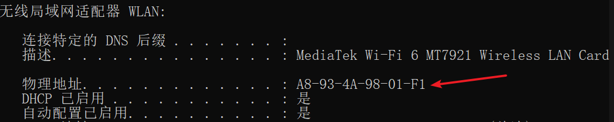

### IP地址
Internet Protocol Address
互联网协议地址，或 网际协议地址
IP地址是IP协议提供的一种统一的地址格式，IP地址是设备在网络中的具体地址

### 按协议分类
- IPv4:互联网协议第四版，由四个数组成，每个数取值范围为0~255，用.分隔，0.0.0.0~255.255.255.255
- IPv6：互联网协议第六版，由8个数组成，每个数取值范围为0~65535，用：分隔。0.0.0.0.0.0.0.0~65535.65535.65535.....
### 按使用范围分类
- 公网IP：连接外网，和远程设备进行通信时使用的IP地址
- 私网IP：不能用来上网，只用于局域网内通信
  查看：win + r +cmd + ipconfig 或者 ipconfig/all

### 端口号
IP地址决定设备在网络中的具体地址
而端口是不同应用程序在该设备上的门牌号码
一台设备上不同的应用程序想要进行通信就必须对应一个唯一的端口号

### 使用规则
取值范围 0 ~ 65535,
需要自己为应用程序设置端口号，端口号不能和其他应用程序相同
一般选择1024以上的端口进行使用
1024以下的一般由IANA互联网数字分配机构管理

### Mac地址 
基本概念：Media Access Control Address
媒体存取控制地址，也称局域网地址，Mac地址，以太网地址，物理地址

用来确认网络设备位置的地址，在OSI模型中，第三层网络层负责IP地址，第二层数据链路层则负责Mac地址，Mac地址是用于在网络中标识一个网卡，一台设备可以有多个网卡，每个网卡有唯一Mac地址

设备与网络连接所需要的设备就是网卡

用Mac地址可以实现通信但是是通过每家敲门比对的方式，效率低造成网络巨大负担

Mac地址是身份证号，IP地址是你的住址
Mac地址是物理层面上通信的基础，二进制信息传输的时候还是会找到它
IP地址是逻辑层面上通信的基础，实际开发用ip和端口
### Mac地址构成
Mac地址长度为48位，通常位12个16进制数

前3个字节，16进制数A8-93-4A代表网络硬件制造商的编号，有IEEE（电气电子工程师学会）分配
后3个字节代表该制造商所制造的某个网络产品的系列号
