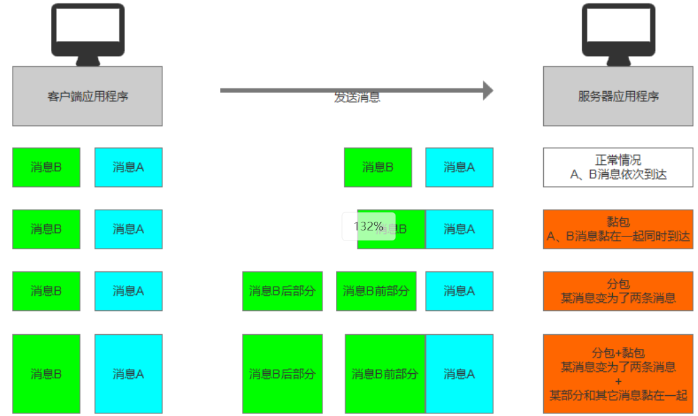
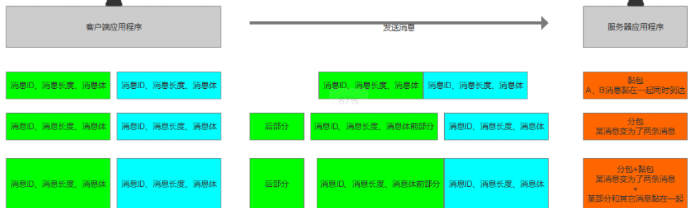

### 什么是分包和粘包
分包黏包是指在网络通信中由于各种因素（网络环境，API规则等）造成的消息与消息之间出现的两种状态
分包：一个消息分成了多个消息进行发送
黏包：一个消息和另一个消息黏在了一起
分包和黏包可能同时发生

### 解决分包，黏包问题
我们收到的消息都是以字节数组形式在程序中体现
前4个字节是消息ID
后面的字节数组全部用来序列化
如果出现分包黏包就会导致序列化报错

如何判断一个消息有没有出现分包黏包
答案是——>消息长度
我们可以如同处理区分消息类型时逻辑一样
为消息添加头部，消息的长度来组成头部
接受消息时通过消息长度来判断是否分包黏包
对消息进行拆分处理，合并处理
我们每次只处理完整的消息

### 实践解决
1.为所有消息添加头部，用于存储其消息长度
在[18.区分消息类型](18.区分消息类型.md)的PlayerMsg自定义类消息类中
```C#
public class PlayerMsg:BaseMsg
{
	public int playerID;
	public PlayerData playerData;
	public override byte[] Writing()
	{
		int index = 0;
		int bytesNum = GetBytesNum();
		byte[] bytes = new byte[bytesNum];
		// 先写消息ID
		WriteInt(bytes,GetID(),ref index);
		// 写入消息体的长度,减8的目的是只存储消息体的长度
		WriteInt(bytes,bytesNum - 8,ref index);
		// 写这个消息的成员变量
		WriteInt(bytes,playerID,ref index);
		WriteData(bytes,playerData,ref index);
		return bytes;
	}
	// 反序列化方法调用之前会先把消息类型ID解析出来，用于判断到底使用哪一个自定义类来反序列化
	public override int Reading(byte[] bytes,int beginIndex = 0)
	{
		int index = beginIndex;
		playerID = ReadInt(bytes,ref index);
		playerData = ReadData<PlayerData>(bytes,ref index);
		return index - beginIndex;
	}
	public override int GetBytesNum()
	{
		return 4 + // 消息ID的长度
			4 + // 消息体的长度
			4 + // playerID的字节数组长度
			playerData.GetBytesNum(); // playerData的字节数组长度
	}
	// 自定义的消息ID 区分消息类
	public override int GetID()
	{
		return 1001;
	}
}
```
2.根据分包，黏包的表现情况，修改接受消息处的逻辑
[15.客户端综合](15.客户端综合.md)经过区分消息类型处理后的NetMgr
```C#
// 网络管理模块
public class NetMgr : MonoBehaviour
{
	private static NetMgr instance;
	public static NetMgr Instance => instance;
	// 客户端Socket
	private Socket socket;
	// 用于发送消息的队列公共容器，主线程往里面放，发送线程从里面取出来
	private Queue<BaseMsg> sendMsgQueue = new Queue<BaseMsg>();
	// 用于接受信息的对象，公共容器，子线程往里面放，主线程往里面取
	private Queue<BaseMsg> receiveMsgQueue = new Queue<BaseMsg>();
	// 收消息的水桶（容器）
	//private byte[] receiveBytes = new byte[1024*1024];变成临时变量消耗性能节约内存
	// 返回收到的字节数
	//private int receiveNum;
	// 用于处理分包时缓存的字节数组和字节数组长度
	private byte[] catcheBytes = new byte[1024 * 1024];
	private int cacheNum = 0;
	private bool isConnected = false;// 是否连接
	void Awake()
	{
		instance = this;
		DontDestoryOnLoad(this.gameObject);
	}
	void Update()
	{
		// Update中处理消息
		if(receiveQueue.Count > 0)
		{
			BaseMsg msg = receiveQueue.Dequeue();
			if(msg is PlayerMsg)
			{
				PlayerMsg playerMsg = (msg as PlayerMsg);
				print(playerMsg.playerID);
				print(playerMsg.playerData.name);
			}
		}
	}
	// 连接服务器
	public void Connect(string ip,int port)
	{
		if(isConnected) // 是连接状态直接返回
			return;
		if(socket == null)
			socket = new Socket(AddressFamily.InterNetWork,Socket.Stream,ProtocolType.Tcp);
		IPEndPoint ipPoint = new IPEndPoint(IPAddress.Parse(ip),port);
		try
		{
			socket.Connect(ipPoint);
			isConnected = true;
			// 开启发送线程
			ThreadPool.QueueUserWorkItem(SendMsg);
			// 开启接受线程
			ThreadPool.QueueUserWorkItem(ReceiveMsg);
		}
		catch (SocketException e)
		{
			if(e.ErrorCode == 10061)
				print("服务器拒绝连接");
			else
				print("连接失败" + e.ErrorCode + e.Message);
		}
	}
	// 主线程发送消息到一个队列上
	public void Send(BaseMsg msg)
	{
		sendMsgQueue.Enqueue(msg); //入队列
	}
	// 发送线程，看公共容器中有没有消息，有就取出来发掉
	private void SendMsg(object obj)
	{
	
		while(isConnected)
		{
			if(sendMsgQueue.Count>0)
			{
				socket.Send(sendMsgQueue.Dequeue().Writing());
			}
		}
	}
	// 处理消息是新开的一个线程，这里将消息存到队列里面，主线程在Update里面取队列内容即可。
	// 为什么这里需要容器，因为Unity中 子线程是不能访问到父线程里面的一些变量的。
	private void ReceiveMsg(object obj)
	{
		while (isConnected)
		{
			if(socket.Available > 0)
			{
				byte[] receiveBytes = new byte[1024*1024];
				int receiveNum = socket.Receive(receiveBytes);
				HandleReceiveMsg(receiveBytes,receiveNum);
					//// 首先把收到字节数组的前4个字节，读取出来得到ID
					//int msgID = BitConverter.ToInt32(receiveBytes,0);
					//BaseMsg baseMsg = null;
					//switch(msgID)
					//{
					//	case 1001:
					//		PlayerMsg msg = new PlayerMsg();
					//		msg.Reading(receiveBytes,4);
					//		baseMsg = msg;// 父类装子类
					//		break;
					//}
					//// 如果消息为空，那么证明是不知道类型的消息，没有解析
					//if(baseMsg == null)
					//	continue; // 跳过后面代码
					//// 收到消息，解析消息为字符串，并放入公共容器
					//receiveQueue.Enqueue(baseMsg);
			}
		}
	}
	// 处理接收消息分包黏包问题的方法，第二个参数是接收到的字节数组的长度，分包处理时
	private void HandleReceiveMsg(byte[] receiveBytes,int receiveNum)
	{
		int msgID = 0;
		int msgLength = 0;
		int nowIndex = 0;
		// 收到消息时应该看看之前有没有缓存的，如果有直接拼接已有的尾部
		receiveBytes.CopyTo(cacheBytes,cacheNum); //将新数据追加到cacheBytes的末尾。
		cacheNum += receiveNum;
		// 黏包只需要把消息一条一条取出来
		while(true)
		{
			msgLength = -1;// 避免上回msgLength解析残留导致第一个if进了第二个没进。
			if(cacheNum - nowIndex>= 8)
			{
				// 解析ID
				msgID = BitConverter.ToInt32(cacheBytes,nowIndex);
				nowIndex += 4;
				// 解析长度,长度是一个int类型，长度具体的值在方法的最后加上了。
				msgLength = BitConverter.ToInt32(cacheBytes,nowIndex);
				nowIndex += 4;
			}
			if(cacheNum - nowIndex >= msgLength && msgLength != -1)
			{
			// 解析消息体
				BaseMsg baseMsg = null;
				switch(msgID)
				{
					case 1001:
						PlayerMsg msg = new PlayerMsg();
						msg.Reading(cacheBytes,nowIndex);
						baseMsg = msg;
						break;
				}
				if(baseMsg != null)
					receiveQueue.Enqueue(baseMsg);
				nowIndex += msgLength;
				if(nowIndex == cacheNum)// 刚好把缓存里面的字节数组解析完
				{
					cacneNum = 0;
					break;
				}
			} 
			else
			{
				// 如果不满足，证明有分包
				// 那么我们需要把当前收到的内容记录下来
				// 有待下次接受到消息后再做处理
				// receiveBytes.CopyTo(cacheBytes,0);
				// cacheNum = receiveNum;
				// 如果进行了id和长度的解析但并没有成功解析消息体，那么我们需要减去nowIndex已经解析了id和长度的8位
				if(msgLength != -1)
					nowIndex -= 8;
				// 把这8位还有之后没有解析的字节数内容，移到前面来，用于缓存下次继续解析
				// 再自身数组中将某一段拷贝到开头一段
				Array.Copy(cacheBytes,nowIndex,cacheBytes,0,cacheNum - nowIndex);// 从已有的nowIndex开始，copy到cacheBytes的从0开始的cacheNum - nowIndex位
				cacheNum = cacheNum - nowIndex;
				break;
			}
		}
	}
	public void Close()
	{
		if(socket != null)
		{
			socket.Shutdown(SocketShutdown.Both);
			socket.Close();
			isConnected = false;
		}
	}
	// 对象在场景当中被移除后
	private void OnDestory()
	{
		Close();
	}
}
```
