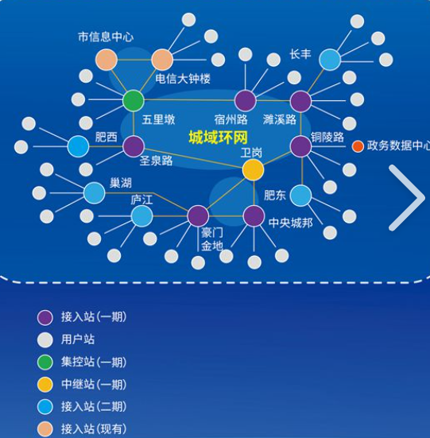

### 局域网(内网)
LAN：Local Area Network
在某一个小区域内由多台设备互联成的计算机组
eg：家里，学校，公司
### 以太网
一种计算机局域技术
局域网中设备的连接规范，数据传输规范等等规则都是基于以太网的技术标准完成的
**以太网是网络连接的一种规则（协议）**
### 以太网 网络拓扑结构
用传输媒体将计算机等各种设备相互连接起来的物理布局，是指设备互联过程构成的几何形状
### 城域网
 
MAN : Metropolitan Area Network
在一个城市范围内所建立的网络
### 广域网(公网，外网)
WAN : Wide Area Network
连接不同地区局域网或城域网设备通信的远程网，能连接地区，城市和国家，形成国际性的远程网络
注意：广域网并不等同于互联网
### 互联网（因特网）
国际网络，是网络与网络之间所串成的庞大网络，网络之间以通用的协议相连，形成逻辑上的单一巨大国际网络
互联网已经将200多个国家和地区的大部分设备连接了起来。
一定程度上，互联网等同于广域网，广域网包含互联网。
互联网使用的技术，在广域网上一定有，但是某些广域网技术互联网不一定有，eg军用的广域网普通老百姓是不会使用的。
互联网本质是人为定义的一系列协议，总称为”互联网协议“
### 因特网
是国际上最大的互联网，所以当我们提到互联网时一般都代指因特网
采用TCP/IP协议簇作为通信的规则
提供了包括万维网（WWW），文件传输（FTP），电子邮件（E-mail）,远程登陆（Telnet）等等服务
### 万维网
WWW（World Wide Web,也称Web，3W等）
是无数网络站点和网页的集合，是构成因特网的主要部分
用浏览器看到的内容，本质上是一个个文档（页面）

