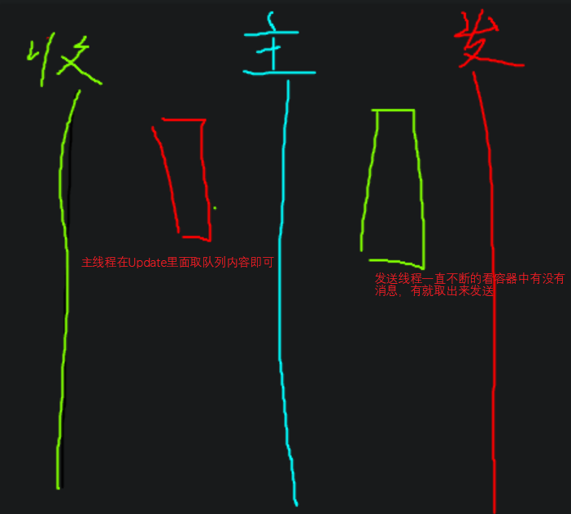

使用Socket客户端知识结合多线程实现1.客户端网络连接不会影响主线程，2.可以随时和服务端进行通信

在Unity客户端中新建脚本
```C#
// 网络管理模块
public class NetMgr : MonoBehaviour
{
	private static NetMgr instance;
	public static NetMgr Instance => instance;
	// 客户端Socket
	private Socket socket;
	// 用于发送消息的队列公共容器，主线程往里面放，发送线程从里面取出来
	private Queue<string> sendMsgQueue = new Queue<string>();
	// 用于接受信息的对象，公共容器，子线程往里面放，主线程往里面取
	private Queue<string> receiveMsgQueue = new Queue<string>();
	// 收消息的水桶（容器）
	private byte[] receiveBytes = new byte[1024*1024];
	// 返回收到的字节数
	private int receiveNum;
	private bool isConnected = false;// 是否连接
	void Awake()
	{
		instance = this;
		DontDestoryOnLoad(this.gameObject);
	}
	void Update()
	{
		if(receiveQueue.Count > 0)
		{
			print(receiveQueue.Dequeue());
		}
	}
	// 连接服务器
	public void Connect(string ip,int port)
	{
		if(isConnected) // 是连接状态直接返回
			return;
		if(socket == null)
			socket = new Socket(AddressFamily.InterNetWork,Socket.Stream,ProtocolType.Tcp);
		IPEndPoint ipPoint = new IPEndPoint(IPAddress.Parse(ip),port);
		try
		{
			socket.Connect(ipPoint);
			isConnected = true;
			// 开启发送线程
			ThreadPool.QueueUserWorkItem(SendMsg);
			// 开启接受线程
			ThreadPool.QueueUserWorkItem(ReceiveMsg);
		}
		catch (SocketException e)
		{
			if(e.ErrorCode == 10061)
				print("服务器拒绝连接");
			else
				print("连接失败" + e.ErrorCode + e.Message);
		}
	}
	// 主线程发送消息到一个队列上
	public void Send(string info)
	{
		sendMsgQueue.Enqueue(info); //入队列
	}
	// 发送线程，看公共容器中有没有消息，有就取出来发掉
	private void SendMsg(object obj)
	{
	
		while(isConnected)
		{
			if(sendMsgQueue.Count>0)
			{
				//出队列转为字节再发送
				socket.Send(Encoding.UTF8.GetBytes(sendMsgQueue.Dequeue()));
			}
		}
	}
	// 处理消息是新开的一个线程，这里将消息存到队列里面，主线程在Update里面取队列内容即可。
	// 为什么这里需要容器，因为Unity中 子线程是不能访问到父线程里面的一些变量的。
	private void ReceiveMsg(object obj)
	{
		while (isConnected)
		{
			if(socket.Available > 0)
			{
				receiveNum = socket.Receive(receiveBytes);
				// 收到消息，解析消息为字符串, 并放入公共容器
				receiveQueue.Enqueue(Encoding.UTF8.GetString(receiveBytes,0,receiveNum));
			}
		}
	}
	public void Close()
	{
		if(socket != null)
		{
			socket.Shutdown(SocketShutdown.Both);
			socket.Close();
			isConnected = false;
		}
	}
}
```
再Unity中游戏入口脚本里面这样写
```C#
public class Main : MonoBehaviour
{
	void Start()
	{
		if(NetMgr.Instance == null)
		{
			GameObject obj = new GameObject("Net");
			obj.AddComponent<NetMgr>();
		}
		NetMgr.Instance.Connect("127.0.0.1",8080);
	}
}
```
测试加一个InputField和Button
```C#
public class Lesson7 : MonoBehaviour
{
	public Button btn;
	public InputField input;
	void Start()
	{
		btn.onClick.AddListener(()=>
		{
			if(input.text != "")
				NetMgr.Instance.Send(input.text);
		})
	}
}
```
