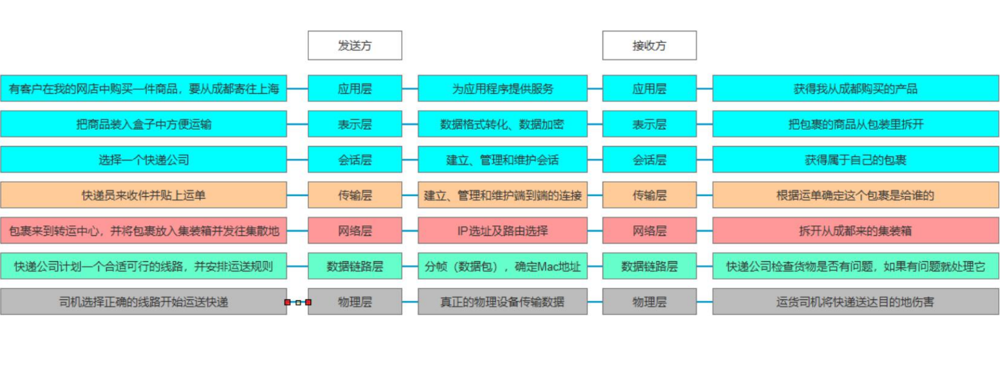

计算机网络中相互通信的对等实体之间交换信息时所必须遵守的规则的集合

## OSI模型
#### 是什么
Open System Interconnection Reference Model 开放式系统互联通信参考模型
是国际组织定义的一套理论基础，主要用于定义网络通信的规则
各公司按照这个标准设计的规则，就可让不同设备利用互联网进行互联通信
#### 规则
OSI 7个层级

#### 每层的职能

从下往上：
- 物理层：将2进制数据利用电脉冲在物理媒介上实现比特流的传输
- 数据链路层：在物理层上方确定0和1的分组方式，并且明确信息是发送给哪台计算机的网卡（Mac地址）
- 网络层： 在上面一层的基础上添加标头，包含信息，本机和目标机IP地址，版本，长度等
- 传输层：建立，管理和维护端到端的连接，会在上一层数据基础上添加标头：发送方接受方端口信息，协议信息等。
从上往下：
- 应用层：外应用程序提供服务，我们可以更具自己要传递的信息决定使用哪一种协议：FTP，HTTP，SMTP，会在原始数据基础上加标头包含协议信息
- 表示层：会将各个操作系统之间的数据转化为与各系统兼容且适合传输的格式，会在上一层数据基础上加标头包含协议信息
- 会话层：建立管理和维护会话，管理消息是收发，连接的断开。

2.TCP/IP协议
是基于OSI的理论基础真正实现的通信规则

我们之后学习的网络通信API底层是基于TCP/IP协议的

