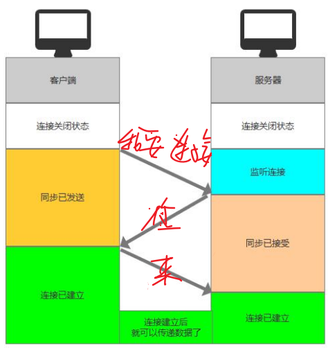
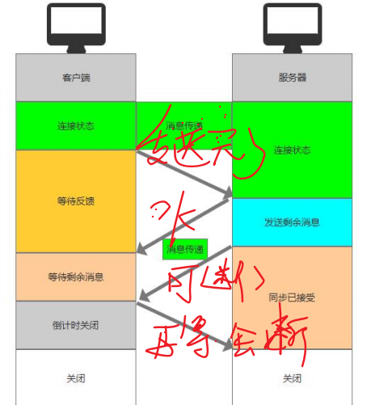

### TCP/IP协议中的重要协议
TCP：传输控制协议
UDP：用户数据报协议

### TCP协议
Transmission Control Protocol，传输控制协议
特点：
- 面向连接：两者之间必须建立可靠的连接
- 一对一
- 可靠性高：消息传送失败会重新发送，不允许丢包
- 有序：按照顺序发送消息

### 三次握手

### 四次挥手

### UDP协议
User Datagram Protocol
特点：
- 无连接：两者之间无需建立连接
- 可靠性低：消息可能丢失，丢失后也不会重发
- 传输效率高，消耗资源小
- n对n

### 总结
TCP适合信息准确性高，效率要求较低的场景
如游戏开发，文件传输，远程登陆等

UDP适合实时性高要求的场景
如直播，即时通讯，游戏开发（可以通过手段让其更可靠）等
