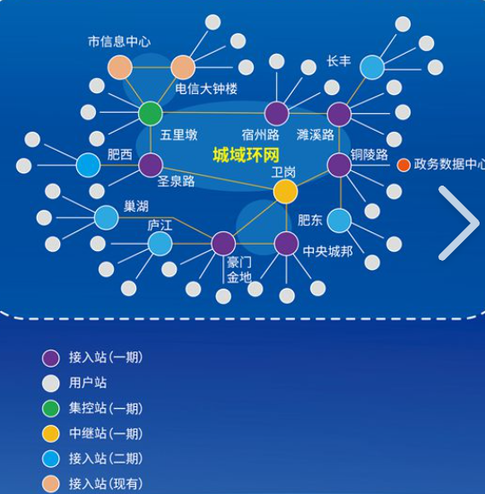

### 局域网

LAN：Local Area Network

在某一个小区域内由多台设备互联成的计算机组

eg：家里，学校，公司

### 以太网
一种计算机局域技术
局域网中设备的连接规范，数据传输规范等等规则都是基于以太网的技术标准完成的
**以太网是网络连接的一种规则（协议）**

### 以太网 网络拓扑结构
用传输媒体将计算机等各种设备相互连接起来的物理布局，是指设备互联过程构成的几何形状

### 城域网
 
MAN : Metropolitan Area Network
在一个城市范围内所建立的网络

### 广域网(公网，外网)
WAN : Wide Area Network
连接不同地区局域网或城域网设备通信的远程网，能连接地区，城市和国家，形成国际性的远程网络
注意：广域网并不等同于互联网

