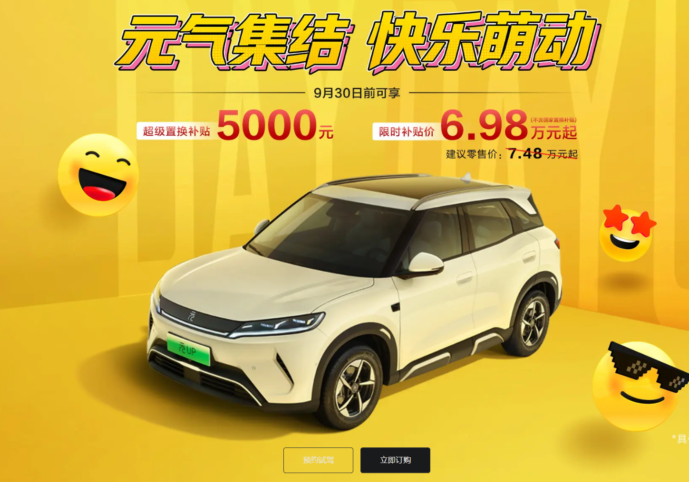

最近有家企业为了省下几十万，刷小聪明欺负应届生，结果公司的市值再6个交易日内蒸发了32亿。

这几周，有一个非常热闹的事情，就是星宇股份被告洋状的事情。

起因是中国车灯龙头企业”星锐股份“去年秋招了大约440名应届生，今年7月份入职，8月就陆续被hr约谈劝退，要么签字拿半个月的补偿走人，要么就调去流水线打螺丝，最终107人离职

不过这也是国内很多企业的一贯手法了，他们也根本不怕员工去劳动仲裁，但是互联网+AI时代的年轻人，这里面107个年轻人没有将希望放在劳动仲裁上，而是直接将投诉状递交上欧盟，港交所已经奔驰大众，这些星宇的大客户里。

奔驰表示，已经立案启动外部专家深入核查，本次用工争议已经触碰合规红线。

大陆中国发言人表示，大众汽车集团对于针对供应商的相关投诉高度重视。已经第一时间启动了专项调查。

这招出来之后，星宇的态度180度大转换。人力资源总监魏廷志董事长兼ceo周晓萍两次道歉。

这件事您最讽刺的就是。中国的企业，中国的员工需要找洋人来给自己出头。

但是仅仅看到星宇这样做，星宇很该骂，但他并没有触及问题的本质。新宇股份找出来的远远不是一家公司的吃相那么简。背后真正需要被追追问的人，正安安静静的躲在这所有的骂声。

第一个问题：星宇为什么这样干。

星宇作为在国内的龙头企业，绝对不是没有钱的。星宇2025年的利润分配方案呢，连同中期分红，总额约为5.66亿元，占了当时净利润的34.83%。
股东分享利益这没什么问题，但是一家公司，拿几个亿汇报股东，但是对刚进来的年轻人，却费劲心机剥削他们。这还没完，这个还是长期获得政府资源倾斜的资源，从23年到25年，公司确认的政府补助累计约为4.52亿元，补助项目包括研发和就业扶持等等

更令人讽刺的时候，还刚刚被评为全国就业与社会保障的先进企业

我猜测这个原因就是：星宇自身的招聘计划没有赶上业务的实际变化，企业对于应届毕业生的秋招通常是提前一年进行的。等他们正式入职，公司面对的实际市场环境可以完全不同。

所以企业可以先招满足够的人，然后再挑选真正需要的留下的人。

之所以可以这么做，是因为企业误招一个人的反悔成本很低。应届毕业生呼之则来，挥之则去。大学生一批接着一批，不需要多少的成本和代价。而学生因为这份工作放弃其他机会的代价却完全由自己承担。

讲到这里，我想往上再讲一层。其实再中国，像星宇这么干的企业多了去了。尽力过秋招的很多都有听闻，只不过之前的年轻人真的没有办法，所以也没有引起广泛的社会关注。所以当这不是个例的时候，我们就需要更深一层去探讨这是不是系统性的问题。

答案就藏在中国汽车产业不断向下转嫁的成本链条里面。
其实星宇股份的日子也不好过，过去三年来星宇股份的毛利率也一直再下降，星宇作为产业的龙头，但也是汽车产业的上游供应商，依然要承受的被车企不断压榨的现实。

2026年上半年，中国汽车行业的税前利润率是3.8%，作为参照，全国工业企业的平均利润率大约是6%。而且这个3.8%是整车加零部件汽车全产业链的税前利润率，不是这个车厂的税前利润率。不是单一整车厂的营业利润率。单看整车制造，利润率只有1.5%

所以车企疯狂压榨供应商，是因为他们自己也在承压。中国的汽车战打了这么多年，今天你降5万，明天我送保险和车膜，后天再叠加一个国补。目前再比亚迪官网，你能直接看到，6.98万就能买下一辆全新的电动车。

这还是只是官方的指导价，消费越来越低，配置越来越高，消费者看起来当然是非常开心。但是如果所有的成本没有下降，车企自己又不愿意亏，那么发布会上少掉的五万块钱。最后总得有出路，一部分来自真正的技术和规模效应，但是另一大部分就会通过采购降价，延长账期和商业票据转移给了供应商。

讲到这里我们还得继续网上问。为什么中国车企会卷到这种程度，
唯一点就是房地产泡沫崩塌之后，对于地方来说，新能源汽车就是一个新的增长点。每个地方都希望引进整车厂，建设产业园和培育上市公司。而大力扶持新能源汽车十几年这么搞下来，如今的中国的新能源汽车的产能，早就远远超过了全球市场的需求。

到这也说差不多了，一个世界第一的产业，全行业挣不到钱了，全产业链在失血，上游的公司靠不交社保活着， 换来了遥遥领先的成绩。
但是一个产业是否成功，不是看它生产了多少的车，买到了多少个国家。还要问一句，整个产业链背后那些实实在在的人，他们的日子变好了吗。谁在承担没有被写进成绩单里面的成本。

所以说回星宇，应该怎么办呢，有两条路，一个是往上谈判，讲压力顶回去，不行就断供，另一个就是往下压，将成本原封不动的转移到自己的员工身上。

我们可以看另一套数据：2022年星宇股份的劳务外报工时是238万小时，到了2025年，达到了1087.42小时。同时，星宇的正式员工，2025年从10426人裁到了7532人。
那么这些外包人员的实际工资是多少呢，这就不得而知了。

所以我们也不能只骂星宇，他们对于那107个应届生，他们是施压者，而对于上游的车企，他们是被施压者。而车企呢，面对产能目标和  谁也不能停下来的价格战的时候，他们同样是抗压者。

所以最后希望每个人都不会成为付出代价的那一个。早点休息，起早锻炼。我们下期见。
