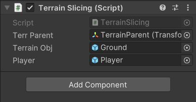

在场景上新建两个空物体，挂载在TerrainManager上面


```c#
using System.Collections;
using System.Collections.Generic;
using UnityEngine;

public class TerrainSlicing : MonoBehaviour
{
    // 用于指定生成地形的父对象，后续生成的地形预制体实例将会挂载在此对象下，方便管理场景层次结构
    public Transform _terrParent;
    // 代表地块预制体，即实际要在场景中生成的地形块的预制资源，需要在Unity编辑器中提前设置好关联的预制体
    public GameObject _terrainObj;
    // 代表玩家对象，脚本会根据玩家的位置来动态加载和管理周围的地形，同样需在编辑器中指定对应的玩家游戏对象
    public GameObject _player;

    // 用于记录已经加载过的地形，键是地形在二维平面（x, y坐标）中的位置，值是对应的地形游戏对象
    private Dictionary<(int x, int y), GameObject> _terrainLoaded;
    // 临时记录地形的字典，在一些处理过程中暂存地形相关信息，键也是地形的二维坐标位置，值为对应的地形游戏对象
    private Dictionary<(int x, int y), GameObject> _dictTemp;
    // 用于记录即将进行隐藏或显示操作的地形相关信息，键为地形二维坐标位置，值是一个包含游戏对象和协程的结构体
    private Dictionary<(int x, int y), GameobjAndCoroutine> _unloadTerrCountDown;
    // 地形对象池，采用栈结构，用于存放暂时不用的地形对象，实现对象复用，减少创建和销毁的开销
    private Stack<GameObject> _terrainPool;
    // 记录玩家上一次所在的位置，初始化为(0, 0)，用于对比玩家位置变化来决定是否更新地形加载情况等
    private (int x, int y) _lastPos = (0, 0);

    // 自定义结构体，用于同时保存游戏对象和与之相关的协程，方便管理一些需要协程操作的地形相关逻辑
    struct GameobjAndCoroutine
    {
        public GameObject Go;
        public Coroutine Cor;
    }

    // 在脚本初始化时调用，用于初始化各个字典和栈等数据结构
    private void Awake()
    {
        // 创建一个新的字典，用于存储已经加载过的地形，初始为空
        _terrainLoaded = new Dictionary<(int x, int y), GameObject>();
        // 创建一个新的字典，用于临时存储地形相关信息，初始为空
        _dictTemp = new Dictionary<(int x, int y), GameObject>();
        // 创建一个新的字典，用于记录即将进行隐藏显示操作的地形相关情况，初始为空
        _unloadTerrCountDown = new Dictionary<(int x, int y), GameobjAndCoroutine>();
        // 创建一个新的栈，用于存放地形对象池中的地形对象，初始为空
        _terrainPool = new Stack<GameObject>();
    }

    // 在游戏开始时调用一次，主要进行以玩家为中心的九宫格地形加载和相关处理逻辑
    private void Start()
    {
        // 循环遍历九宫格的横坐标范围（从 -1 到 1），用于检查玩家周围九宫格位置的地形情况
        for (int i = -1; i < 2; i++)
        {
            // 循环遍历九宫格的纵坐标范围（从 -1 到 1），与横坐标一起确定九宫格内每个位置
            for (int j = -1; j < 2; j++)
            {
                // 尝试从已加载地形的字典中获取对应坐标（i, j）位置的地形对象
                if (_terrainLoaded.TryGetValue((i, j), out GameObject terr))
                {
                    // 如果获取成功，将该地形对象添加到临时字典中
                    _dictTemp.Add((i, j), terr);
                    // 从已加载地形字典中移除该地形对象，因为后续要在临时字典中统一处理
                    _terrainLoaded.Remove((i, j));
                    // 设置该地形对象的位置，根据坐标（i, j）以及地块大小（这里假设每个地块大小为100单位）来确定其在三维空间中的位置
                    terr.transform.position = new Vector3(i * 100f, 0f, j * 100f);
                    // 将该地形对象设置为激活状态，使其在场景中可见并参与渲染等
                    terr.SetActive(true);
                }
                else
                {
                    // 如果在已加载地形字典中没找到对应坐标的地形对象，则尝试从即将隐藏显示的地形记录字典中查找
                    if (_unloadTerrCountDown.TryGetValue((i, j), out GameobjAndCoroutine val))
                    {
                        // 如果找到了，停止与之相关的协程（可能之前正在进行一些等待隐藏或其他定时操作的协程）
                        StopCoroutine(val.Cor);
                        // 将该地形对象添加到临时字典中
                        _dictTemp.Add((i, j), val.Go);
                        // 从即将隐藏显示的地形记录字典中移除该记录
                        _unloadTerrCountDown.Remove((i, j));
                        // 设置该地形对象的位置，原理同前面从已加载地形字典中获取到的地形对象设置位置的方式一样
                        val.Go.transform.position = new Vector3(i * 100f, 0f, j * 100f);
                        // 将该地形对象设置为激活状态
                        val.Go.SetActive(true);
                    }
                    else
                    {
                        // 如果在前面两个字典中都没找到对应地形对象，说明需要新生成一个地形对象
                        var newTerr = GetTerrain();
                        // 将新生成的地形对象添加到临时字典中
                        _dictTemp.Add((i, j), newTerr);
                        // 设置新地形对象的位置
                        newTerr.transform.position = new Vector3(i * 100f, 0f, j * 100f);
                        // 将新地形对象设置为激活状态
                        newTerr.SetActive(true);
                    }
                }
            }
        }
        // 交换两个字典的引用，即将临时字典中的内容整体转移到已加载地形字典中，方便后续的处理逻辑基于新的已加载地形情况进行操作
        (_terrainLoaded, _dictTemp) = (_dictTemp, _terrainLoaded);
    }

    // 在固定更新帧调用（每固定时间间隔调用一次，常用于物理相关或需要稳定频率更新的逻辑），用于实时根据玩家位置变化来管理地形的加载、卸载和显示隐藏等操作
    private void FixedUpdate()
    {
        // 先确保玩家对象已被正确赋值（不为null），避免后续操作出现空引用异常
        if (_player != null)
        {
            // 记录角色在地图上的位置，通过将玩家在世界坐标中的x和z坐标除以地块大小（100f）并四舍五入取整，得到对应的地形坐标位置
            (int x, int y) pos = (Mathf.RoundToInt(_player.transform.position.x / 100f), Mathf.RoundToInt(_player.transform.position.z / 100f));
            // 当玩家位置发生改变时（与上一次记录的位置不同），进行以下地形管理相关操作，即玩家进入了新的区域
            if (!(pos == _lastPos))
            {
                // 更新记录玩家的上一次位置为当前新位置
                _lastPos = pos;
                // 清空临时字典，准备重新记录新区域相关的地形信息
                _dictTemp.Clear();

                // 围绕玩家当前进入的新地形的周围九宫格一圈进行检查，确定需要加载显示或处理的地形情况
                for (int i = pos.x - 1; i < pos.x + 2; i++)
                {
                    for (int j = pos.y - 1; j < pos.y + 2; j++)
                    {
                        // 如果_terrainLoaded已经存储有该地形的游戏对象（即之前加载过且现在仍在范围内的地形）
                        if (_terrainLoaded.TryGetValue((i, j), out GameObject terr))
                        {
                            // 将该地形对象添加到临时字典中
                            _dictTemp.Add((i, j), terr);
                            // 从已加载地形字典中移除该地形对象，后续统一在临时字典基础上处理
                            _terrainLoaded.Remove((i, j));
                            // 设置该地形对象的位置，根据当前九宫格坐标（i, j）和地块大小确定其准确位置
                            terr.transform.position = new Vector3(i * 100f, 0f, j * 100f);
                            // 将该地形对象设置为激活状态，使其在场景中可见
                            terr.SetActive(true);
                        }
                        else
                        {
                            // 如果在已加载地形字典中没找到，再尝试从即将隐藏显示的地形记录字典中查找该地形对象
                            if (_unloadTerrCountDown.TryGetValue((i, j), out GameobjAndCoroutine val))
                            {
                                // 如果找到了，停止隐藏地块的协程（比如玩家短暂离开又快速返回该地块的情况，就停止隐藏它的协程）
                                StopCoroutine(val.Cor);
                                // 将该地形对象添加到临时字典中
                                _dictTemp.Add((i, j), val.Go);
                                // 从即将隐藏显示的地形记录字典中移除该记录
                                _unloadTerrCountDown.Remove((i, j));
                                // 设置该地形对象的位置
                                val.Go.transform.position = new Vector3(i * 100f, 0f, j * 100f);
                                // 将该地形对象设置为激活状态
                                val.Go.SetActive(true);
                            }
                            else
                            {
                                // 如果前面两个字典都没找到，说明需要新生成一个地形对象来填充该位置
                                var newTerr = GetTerrain();
                                // 将新生成的地形对象添加到临时字典中
                                _dictTemp.Add((i, j), newTerr);
                                // 设置新地形对象的位置
                                newTerr.transform.position = new Vector3(i * 100f, 0f, j * 100f);
                                // 将新地形对象设置为激活状态
                                newTerr.SetActive(true);
                            }
                        }
                    }
                }

                // 遍历已加载地形字典，此时字典内的对象都不在角色当前九宫格一圈范围内，需要对它们进行隐藏显示相关的准备操作
                foreach (var item in _terrainLoaded)
                {
                    // 对于每个不在当前九宫格范围内的地形对象，添加到即将隐藏显示的地形记录字典中，并开启一个协程来处理延迟隐藏地块的操作
                    _unloadTerrCountDown.Add(item.Key, new GameobjAndCoroutine
                    {
                        Cor = StartCoroutine(RemoveTerrDelay(item.Key)), // 开启取消地块显示的协程，协程会在一定延迟后隐藏地块
                        Go = item.Value,
                    });
                }
                // 清空已加载地形字典，因为前面已经对其中需要处理的对象都做了相应安排（放入了即将隐藏显示的字典或者临时字典等）
                _terrainLoaded.Clear();
                // 再次交换两个字典的引用，将临时字典中的内容整体转移到已加载地形字典中，完成本次位置变化后的地形管理操作更新
                (_terrainLoaded, _dictTemp) = (_dictTemp, _terrainLoaded);
            }
        }
    }

    /// <summary>
    /// 取消地块显示的协程方法，用于在等待一定时间（这里是3秒）后隐藏地块显示
    /// </summary>
    /// <param name="pos">地块对应的坐标位置，用于在协程中准确找到要隐藏的地块对象</param>
    /// <returns>返回一个IEnumerator类型，用于在协程中控制执行流程和等待时间等</returns>
    private IEnumerator RemoveTerrDelay((int x, int y) pos)
    {
        // 等待3秒，在这3秒内地块依然保持显示状态，给玩家可能返回该地块的机会（例如短暂离开又回来的情况）
        yield return new WaitForSeconds(3f);
        // 在等待3秒后，尝试从即将隐藏显示的地形记录字典中获取对应坐标位置的地块相关信息（游戏对象和协程等）
        if (_unloadTerrCountDown.TryGetValue(pos, out var v))
        {
            // 如果获取成功，调用回收地块的方法，将地块对象放入对象池并设置为隐藏状态
            RecycleTerrain(v.Go);
            // 从即将隐藏显示的地形记录字典中移除该地块的记录，因为已经完成了隐藏操作
            _unloadTerrCountDown.Remove(pos);
        }
    }

    /// <summary>
    /// 获取一个地块的方法，如果地形对象池中有可用的地形对象，则从池中取出一个返回，否则就实例化一个新的地形预制体并返回
    /// </summary>
    /// <returns>返回一个地形游戏对象，可能是从对象池获取的，也可能是新实例化的</returns>
    private GameObject GetTerrain()
    {
        // 检查地形对象池中的对象数量，如果大于0，表示有可用的地形对象
        if (_terrainPool.Count > 0)
        {
            // 从地形对象池中弹出一个地形对象并返回，实现对象复用
            return _terrainPool.Pop();
        }
        // 如果对象池中没有可用地形对象，则实例化一个新的地形预制体，以_terrParent为父对象进行挂载，并返回这个新实例化的地形对象
        return Instantiate(_terrainObj, _terrParent);
    }

    /// <summary>
    /// 回收地块的方法，将地块对象设置为隐藏状态后放入地形对象池，实现对象的复用，节省资源
    /// </summary>
    /// <param name="t">要回收的地形游戏对象</param>
    private void RecycleTerrain(GameObject t)
    {
        // 将地块对象设置为非激活状态，使其在场景中不可见，相当于隐藏起来
        t.SetActive(false);
        // 将该地块对象放入地形对象池，以便后续需要时可以再次取出使用
        _terrainPool.Push(t);
    }
}
```